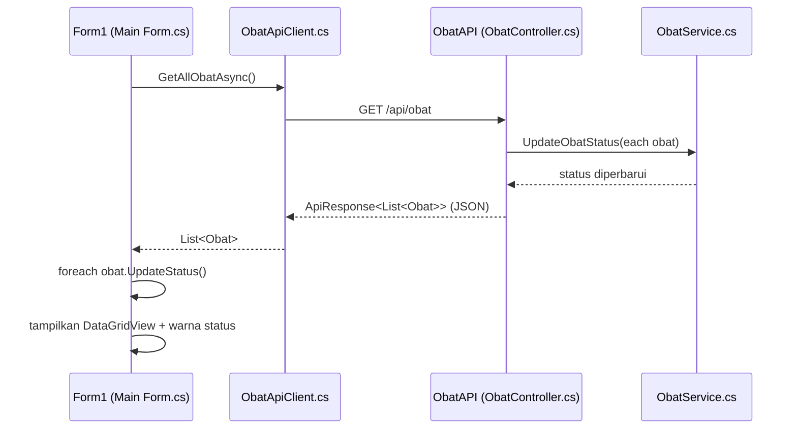

# Dokumentasi Teknis (Belajar) - Fitur **Status Obat** & **API** (TUBES-KPL)

Dokumen ini menjelaskan **bagaimana project berjalan**, **bagaimana antar-file saling terhubung**, dan **alur komunikasi Client <-> API**. Fokus utama: **fitur status obat** dan **fitur API**.

> Catatan penting untuk belajar: repository ini berisi beberapa file yang terlihat berasal dari versi berbeda (mis. ada yang memakai `Nama` vs `nama`). Dokumen ini menjelaskan **alur yang "dimaksud" oleh arsitektur** berdasarkan kode yang ada, sekaligus menandai beberapa titik yang berpotensi membingungkan saat dibaca/didemokan.

---

## 1) Gambaran Arsitektur

Solution `TubesKPL.sln` berisi 2 project:

1. **`TubesKPL`** (WinForms, .NET Framework 4.7.2)  
   Peran: **Client/UI** untuk menampilkan & mengelola data obat.

2. **`ObatAPI`** (ASP.NET Core, .NET 6)  
   Peran: **Server REST API** untuk CRUD data obat + endpoint status.

Komunikasi antar project menggunakan:
- Transport: **HTTPS** (development, self-signed cert)
- Format data: **JSON**
- Endpoint dasar (berdasarkan `ObatAPI/Properties/launchSettings.json`):  
  - `https://localhost:7103` (HTTPS)  
  - `http://localhost:5075` (HTTP)

---

## 2) "Peta File" yang Relevan (Status & API)

> Bagian setelah ini menambahkan **cuplikan kode (code excerpt)** dari file-file penting, supaya kamu bisa melihat langsung "baris kode" yang menjalankan fitur status obat & API. Cuplikan diambil dari kode yang ada di repo ini (bukan pseudocode).

### Client / WinForms (`TubesKPL`)

- `Program.cs`  
  Entry point aplikasi WinForms. Mengizinkan self-signed certificate untuk koneksi HTTPS lokal, lalu menjalankan form login.

- `FormLogin.cs`  
  Login sederhana (hardcoded list akun). Setelah login sukses, membuka `Form1`.

- `Main Form.cs`  
  Mendefinisikan `Form1` (main UI). Pada `Form1_Load`, mengambil data obat dari API via `ObatApiClient`. Setelah itu data ditampilkan ke `DataGridView` dan status ditampilkan/diwarnai.

- `ObatApiClient.cs`  
  HTTP client untuk memanggil REST API (`GET/POST/PUT/DELETE`). Mengatur JSON options agar cocok dengan format API (camelCase + enum sebagai string).

- `Obat.cs`  
  Model data `Obat` di sisi client, termasuk enum `StatusObat` dan method `UpdateStatus()` yang menghitung status memakai state machine (`ObatStateMachine`).

- `ObatStateMachine.cs`  
  "Mesin" penentu status obat berdasarkan `stok` dan `expiredDate`. Ini inti fitur **status obat** di sisi client.

- `Update Form.cs`  
  Mendefinisikan `Form2` untuk mengedit data `Obat` dan memanggil `editingObat.UpdateStatus()` setelah perubahan.

- `FormTambahObat.cs`  
  Form untuk membuat `Obat` baru (di sisi client). Setelah dibuat, `Obat` langsung memiliki status (karena constructor memanggil `UpdateStatus()`).

> Ada file lain yang menyinggung status, misalnya `StatusConfig.cs` dan `NotifikasiHelper.cs`. Namun di repo ini ada indikasi sebagian file belum konsisten dipakai/di-include project. Untuk belajar konsep, file-file itu tetap berguna sebagai contoh "Table-Driven Construction" (mapping status->warna/teks) dan "Notification helper".

### Server / API (`ObatAPI`)

- `ObatAPI/Program.cs`  
  Konfigurasi ASP.NET Core: Controllers, JSON serialization (camelCase, enum string), Swagger, CORS, Dependency Injection untuk service.

- `ObatAPI/Controllers/ObatController.cs`  
  Endpoint REST utama: CRUD obat + endpoint ringkasan status + list obat expired/low stock/soon-to-expire.

- `ObatAPI/Models/Obat.cs`  
  Model `Obat` di sisi server + DataAnnotations untuk validasi input.

- `ObatAPI/Enums/ObatStatus.cs`  
  Enum status versi server (`Available`, `LowStock`, `Expired`, `SoonToExpire`).

- `ObatAPI/Services/ObatService.cs`  
  Business logic status (update status) + validasi + helper "expiring soon".

- `ObatAPI/Models/ApiResponse.cs`  
  Wrapper response standar (`success`, `message`, `data`, `errors`) + model `ObatStatusSummary`.

---

## 2.1) Cuplikan kode per file (yang relevan)

### 0) Catatan penting: "file yang benar-benar jalan" ditentukan oleh `.csproj`

Di Visual Studio/.NET, sebuah file `.cs` baru akan ikut dikompilasi kalau:
- file tersebut **ada** di folder project, dan
- file tersebut **di-include** di `TubesKPL.csproj` (untuk model project style lama seperti repo ini).

Cuplikan daftar file yang di-compile (dari `TubesKPL.csproj`):

```xml
<!-- TubesKPL.csproj (excerpt) -->
<ItemGroup>
  <Compile Include="Main Form.cs">
    <SubType>Form</SubType>
  </Compile>
  <Compile Include="Obat.cs" />
  <Compile Include="ObatApiClient.cs" />
  <Compile Include="Update Form.cs">
    <SubType>Form</SubType>
  </Compile>
  <Compile Include="FormLogin.cs">
    <SubType>Form</SubType>
  </Compile>
  <Compile Include="FormTambahObat.cs">
    <SubType>Form</SubType>
  </Compile>
  <Compile Include="Program.cs" />
</ItemGroup>
```

Kenapa ini penting saat belajar:
- Repo ini punya beberapa file yang terlihat "relevan" (mis. `ObatStateMachine.cs`, `StatusConfig.cs`, `NotifikasiHelper.cs`, `Form1.cs`), tetapi **belum tentu** semuanya ikut dikompilasi/terpakai oleh aplikasi saat run.
- Kalau dosen bertanya "kenapa file X tidak berpengaruh?", jawaban yang bagus adalah: "karena file X belum di-include di project `.csproj` (atau itu file versi lama/sisa refactor)".

Catatan tambahan (berdasarkan isi repo saat ini):
- `Main Form.cs` memanggil `ObatApiService.Initialize(daftarObat)`, tetapi class/file `ObatApiService` tidak ditemukan saat dicari di repo.
- `TubesKPL.csproj` juga masih memiliki referensi compile ke beberapa file yang tidak ditemukan (mis. `JsonDataManager.cs`, `ObatApiService.cs`), jadi jika build error, cek konsistensi daftar file ini.

### A) Client / WinForms (`TubesKPL`)

#### 1) `Program.cs` - entry point + bypass sertifikat dev

Inti yang terjadi:
- Aplikasi WinForms dimulai di `Main()`
- Karena API lokal memakai HTTPS dev certificate, client **membypass validasi sertifikat**
- Lalu menjalankan form login

Cuplikan:

```csharp
// Program.cs
[STAThread]
static void Main()
{
    ServicePointManager.ServerCertificateValidationCallback +=
        (sender, cert, chain, sslPolicyErrors) => true;

    Application.EnableVisualStyles();
    Application.SetCompatibleTextRenderingDefault(false);

    Application.Run(new FormLogin());
}
```

Kenapa penting:
- Baris `ServerCertificateValidationCallback` membuat request HTTPS ke `https://localhost:7103` tidak gagal di development.

#### 2) `FormLogin.cs` - login lalu membuka `Form1`

Cuplikan handler login:

```csharp
// FormLogin.cs
private void btnLogin_Click(object sender, EventArgs e)
{
    string inputUsername = txtUsername.Text;
    string inputPassword = txtPassword.Text;

    Akun akunValid = daftarAkun.FirstOrDefault(akun => akun.Username == inputUsername && akun.Password == inputPassword);

    if (akunValid != null)
    {
        MessageBox.Show($"Login Berhasil!\nSelamat datang, {akunValid.Username} ({akunValid.Role})",
                        "Sukses", MessageBoxButtons.OK, MessageBoxIcon.Information);

        this.Hide();
        Form1 formUtama = new Form1();
        formUtama.ShowDialog();
        this.Close();
    }
    else
    {
        MessageBox.Show("Username atau Password salah!", "Login Gagal", MessageBoxButtons.OK, MessageBoxIcon.Error);
        txtPassword.Clear();
        txtUsername.Focus();
    }
}
```

Koneksi ke API belum terjadi di sini. API mulai dipanggil saat `Form1` (main form) load.

#### 3) `Main Form.cs` - memanggil API + menampilkan status ke UI

Bagian paling penting ada di `Form1_Load()`:

```csharp
// Main Form.cs
private async void Form1_Load(object sender, EventArgs e)
{
    ObatApiClient client = null;
    try
    {
        // [AYONDI - INTEGRATION] Load data dari ObatAPI menggunakan HttpClient
        client = new ObatApiClient("https://localhost:7103");

        System.Console.WriteLine("[MAIN FORM] Fetching data from API...");

        // Async call untuk ambil semua data obat dari API
        daftarObat = await client.GetAllObatAsync();

        System.Console.WriteLine($"[MAIN FORM] Received {(daftarObat?.Count ?? 0)} items from API");

        if (daftarObat == null || daftarObat.Count == 0)
        {
            MessageBox.Show(
                "Tidak ada data dari API. Menggunakan sample data.\n\n" +
                "Pastikan ObatAPI sudah running di https://localhost:7103",
                "Info",
                MessageBoxButtons.OK,
                MessageBoxIcon.Information
            );

            // Fallback: gunakan sample data jika API kosong
            daftarObat = GetSampleData();
        }

        // [AYONDI - REFACTOR] Initialize API service dengan data dari server
        ObatApiService.Initialize(daftarObat);

        // [AYONDI - REFACTOR] Tampilkan data di grid dan notifikasi
        TampilkanData(daftarObat);
        TampilkanNotifikasi();
    }
    catch (Exception ex)
    {
        System.Console.WriteLine($"[ERROR] Form1_Load: {ex.Message}");
        System.Console.WriteLine($"[ERROR] StackTrace: {ex.StackTrace}");

        MessageBox.Show(
            $"Error loading data from API:\n\n{ex.Message}\n\n" +
            "Pastikan ObatAPI sudah running di https://localhost:7103\n\n" +
            "Menggunakan sample data sebagai fallback.",
            "API Connection Error",
            MessageBoxButtons.OK,
            MessageBoxIcon.Warning
        );

        // Fallback: gunakan sample data jika API tidak bisa diakses
        daftarObat = GetSampleData();

        ObatApiService.Initialize(daftarObat);
        TampilkanData(daftarObat);
        TampilkanNotifikasi();
    }
    finally
    {
        if (client != null)
            client.Dispose();
    }
}
```

Lalu, sebelum data ditampilkan, status setiap obat di-update di `TampilkanData()`:

```csharp
// Main Form.cs
private void TampilkanData(List<Obat> data)
{
    // Update status setiap obat
    foreach (var obat in data)
    {
        obat.UpdateStatus();
    }

    // Buat DataTable dengan struktur kolom
    DataTable dt = new DataTable();
    dt.Columns.Add("Nama Obat");
    dt.Columns.Add("Kategori");
    dt.Columns.Add("Stok");
    dt.Columns.Add("Harga");
    dt.Columns.Add("Tanggal Expired");
    dt.Columns.Add("Status");

    // Populate DataTable dengan property baru (PascalCase)
    foreach (var obat in data)
    {
        dt.Rows.Add(
            obat.Nama,
            obat.Kategori,
            obat.Stok,
            obat.Harga.ToString("C"),
            obat.ExpiredDate.ToString("dd/MM/yyyy"),
            obat.Status  // Status sekarang string dari API
        );
    }

    // Set DataSource dan terapkan warna status
    tblObat.DataSource = dt;
    TerapkanWarnaStatus();
}
```

Warna baris berdasarkan kolom "Status":

```csharp
// Main Form.cs
private void TerapkanWarnaStatus()
{
    for (int i = 0; i < tblObat.Rows.Count; i++)
    {
        string status = tblObat.Rows[i].Cells[5].Value?.ToString();
        DataGridViewRow row = tblObat.Rows[i];

        if (status == "Expired")
            row.DefaultCellStyle.BackColor = Color.FromArgb(255, 200, 200);
        else if (status == "LowStock")
            row.DefaultCellStyle.BackColor = Color.FromArgb(255, 255, 200);
        else
            row.DefaultCellStyle.BackColor = Color.FromArgb(200, 255, 200);
    }
}
```

Catatan belajar:
- `TampilkanData()` memanggil `obat.UpdateStatus()` (client hitung ulang status) walau server juga menghitung status sebelum mengirim response.

#### 4) `Obat.cs` - model client + memanggil state machine

Bagian yang menentukan status:

```csharp
// Obat.cs
public StatusObat Status { get; set; } = StatusObat.Available;

public void UpdateStatus()
{
    string statusString = ObatStateMachine.CalculateStatus(Stok, ExpiredDate);
    Status = ObatStateMachine.GetStatusEnum(statusString);
}
```

Enum status di client:

```csharp
// Obat.cs
public enum StatusObat
{
    Available = 0,
    LowStock = 1,
    Expired = 2,
    SoonToExpire = 3
}
```

Poin penting:
- `UpdateStatus()` adalah "jembatan" dari data (`Stok`, `ExpiredDate`) ke `Status` (enum).

#### 5) `ObatStateMachine.cs` - aturan status (priority)

Aturan utama (prioritas):

```csharp
// ObatStateMachine.cs
public static string CalculateStatus(int stok, DateTime expiredDate)
{
    // Priority 1: Expired
    if (expiredDate.Date < DateTime.Now.Date)
        return "Expired";

    // Priority 2: SoonToExpire (strict: 0 < days < 30)
    int daysUntilExpire = (int)(expiredDate.Date - DateTime.Now.Date).TotalDays;
    if (daysUntilExpire > 0 && daysUntilExpire < SOON_TO_EXPIRE_DAYS)
        return "SoonToExpire";

    // Priority 3: LowStock
    if (stok <= LOW_STOCK_THRESHOLD)
        return "LowStock";

    // Priority 4: Available
    return "Available";
}
```

Konversi string -> enum:

```csharp
// ObatStateMachine.cs
public static StatusObat GetStatusEnum(string statusString)
{
    switch (statusString.ToLower())
    {
        case "available": return StatusObat.Available;
        case "soontoexpire": return StatusObat.SoonToExpire;
        case "lowstock": return StatusObat.LowStock;
        case "expired": return StatusObat.Expired;
        default: return StatusObat.Available;
    }
}
```

Kenapa dibuat dua tahap (string lalu enum)?
- Karena `CalculateStatus()` mengembalikan nama status, lalu `GetStatusEnum()` memastikan `Status` disimpan sebagai enum (type-safe).

#### 6) `ObatApiClient.cs` - HTTP client untuk akses API

Constructor: set base URL, bypass HTTPS dev cert, dan pasang JSON options.

```csharp
// ObatApiClient.cs
public ObatApiClient(string baseUrl = "https://localhost:7103")
{
    // Defensive: Null/empty check
    if (string.IsNullOrWhiteSpace(baseUrl))
        throw new ArgumentNullException(nameof(baseUrl), "Base URL tidak boleh kosong");

    _baseUrl = baseUrl;
    var handler = new HttpClientHandler();
    handler.ServerCertificateCustomValidationCallback = (msg, cert, chain, errs) => true;
    _httpClient = new HttpClient(handler) { Timeout = TimeSpan.FromSeconds(30) };

    // Configure JSON options for camelCase property naming
    _jsonOptions = new JsonSerializerOptions
    {
        PropertyNamingPolicy = JsonNamingPolicy.CamelCase,
        PropertyNameCaseInsensitive = true,
        WriteIndented = false,
        DefaultIgnoreCondition = JsonIgnoreCondition.WhenWritingNull
    };
    _jsonOptions.Converters.Add(new JsonStringEnumConverter(JsonNamingPolicy.CamelCase));
}
```

Contoh method `GET all`:

```csharp
// ObatApiClient.cs
public async Task<List<Obat>> GetAllObatAsync()
{
    try
    {
        // Defensive: Validate base URL
        if (string.IsNullOrWhiteSpace(_baseUrl))
            throw new Exception("Base URL tidak valid");

        string url = $"{_baseUrl}/api/obat";
        var response = await _httpClient.GetAsync(url);

        // Defensive: Check response status
        if (!response.IsSuccessStatusCode)
            throw new ApiException($"API failed with status {response.StatusCode}", response.StatusCode);

        // Defensive: Ensure content exists
        string json = await response.Content.ReadAsStringAsync();
        if (string.IsNullOrWhiteSpace(json))
        {
            Console.WriteLine("[WARN] API returned empty response");
            return new List<Obat>();
        }

        // Deserialize ApiResponse wrapper
        var apiResponse = JsonSerializer.Deserialize<ApiResponse<List<Obat>>>(json, _jsonOptions);
        return apiResponse?.Data ?? new List<Obat>();
    }
    catch (HttpRequestException ex)
    {
        throw new Exception($"❌ Connection Error: API tidak dapat diakses di {_baseUrl}\nDetail: {ex.Message}", ex);
    }
    catch (TaskCanceledException)
    {
        throw new Exception($"❌ Timeout: ObatAPI tidak merespons dalam 30 detik");
    }
    catch (JsonException ex)
    {
        throw new Exception($"❌ Error parsing JSON response: {ex.Message}", ex);
    }
    catch (Exception ex)
    {
        throw new Exception($"❌ Error GetAllObat: {ex.Message}", ex);
    }
}
```

Wrapper response yang diparse client:

```csharp
// ObatApiClient.cs (inner class)
private class ApiResponse<T>
{
    [JsonPropertyName("data")]
    public T Data { get; set; }

    [JsonPropertyName("success")]
    public bool Success { get; set; }

    [JsonPropertyName("message")]
    public string Message { get; set; }
}
```

Poin penting:
- API server mengirim wrapper `ApiResponse<T>` -> client membaca `data` lalu mengembalikannya sebagai object C# (`List<Obat>` atau `Obat`).

#### 7) `Update Form.cs` - edit obat lalu update status

```csharp
// Update Form.cs
editingObat.ExpiredDate = dtpExpired.Value;
editingObat.UpdateStatus();
```

Artinya: begitu user mengubah stok/harga/expired date, status dihitung ulang untuk item itu.

#### 8) `FormTambahObat.cs` - membuat obat baru (status otomatis dihitung)

```csharp
// FormTambahObat.cs
obatBaru = new Obat(nama, stok, harga, expired, kategoriTerpilih);
```

Constructor `Obat(...)` memanggil `UpdateStatus()`, jadi `obatBaru.Status` sudah terisi ketika dialog ditutup.

#### 9) (Opsional) `StatusConfig.cs` - table-driven mapping status -> UI

Cuplikan mapping menggunakan Dictionary (diambil dari file):

```csharp
// StatusConfig.cs
private static Dictionary<StatusObat, StatusConfig> statusConfigTable = new Dictionary<StatusObat, StatusConfig>()
{
    {
        StatusObat.Available,
        new StatusConfig(
            Color.FromArgb(200, 255, 200),
            "Available",
            "Obat tersedia dengan stok cukup dan belum kadaluarsa"
        )
    },

    {
        StatusObat.LowStock,
        new StatusConfig(
            Color.FromArgb(255, 255, 200),
            "LowStock",
            "Stok obat rendah, segera lakukan pemesanan"
        )
    },

    {
        StatusObat.Expired,
        new StatusConfig(
            Color.FromArgb(255, 200, 200),
            "Expired",
            "Obat sudah kadaluarsa, harus dimusnahkan"
        )
    }
};
```

Catatan:
- Mapping ini belum memasukkan `SoonToExpire`.
- Di `Main Form.cs` saat ini, warna status masih pakai `if/else` langsung.

#### 10) (Opsional) `NotifikasiHelper.cs` - contoh notifikasi berbasis status

Cuplikan konsepnya:

```csharp
// NotifikasiHelper.cs (contoh ide)
var obatExpired = daftarObat.FindAll(o => o.status == StatusObat.Expired);
if (obatExpired.Count > 0) MessageBox.Show("...");
```

Catatan penting:
- File ini memakai property `nama`, `stok`, `expiredDate`, `status` (lowercase) yang **tidak konsisten** dengan model `Obat.cs` (PascalCase: `Nama`, `Stok`, `ExpiredDate`, `Status`).
- Jadi, saat belajar, gunakan file ini sebagai "contoh pola" notifikasi, bukan sebagai sumber kebenaran implementasi yang dipakai `Form1`.

---

### B) Server / API (`ObatAPI`)

#### 1) `ObatAPI/Properties/launchSettings.json` - base URL API

```jsonc
{
  "profiles": {
    "ObatAPI": {
      "launchUrl": "swagger",
      "applicationUrl": "https://localhost:7103;http://localhost:5075"
    }
  }
}
```

Ini yang membuat Swagger bisa dibuka di `https://localhost:7103/swagger`.

#### 2) `ObatAPI/Program.cs` - konfigurasi ASP.NET Core

Yang di-setup:
- Controllers + JSON options (camelCase + enum string)
- Swagger
- Dependency Injection `IObatService`
- CORS `AllowAll`

```csharp
// ObatAPI/Program.cs
using System.Text.Json;
using System.Text.Json.Serialization;
using ObatAPI.Services;

var builder = WebApplication.CreateBuilder(args);

// Mendaftarkan fitur-fitur yang dibutuhkan program API.
builder.Services.AddControllers()
    .AddJsonOptions(options =>
    {
        // Konfigurasi JSON serialization dengan property naming camelCase
        options.JsonSerializerOptions.PropertyNamingPolicy = JsonNamingPolicy.CamelCase;
        options.JsonSerializerOptions.WriteIndented = true;
        options.JsonSerializerOptions.Converters.Add(new JsonStringEnumConverter(JsonNamingPolicy.CamelCase));
        options.JsonSerializerOptions.DefaultIgnoreCondition = JsonIgnoreCondition.WhenWritingNull;
    });

// Menambahkan halaman otomatis agar API mudah dites melalui browser.
builder.Services.AddEndpointsApiExplorer();
builder.Services.AddSwaggerGen();

// Mendaftarkan services untuk dependency injection
builder.Services.AddScoped<IObatService, ObatService>();

// Mengizinkan aplikasi utama yang kita buat untuk mengambil data dari API ini.
builder.Services.AddCors(options =>
{
    options.AddPolicy("AllowAll", builder =>
    {
        builder.AllowAnyOrigin()
               .AllowAnyMethod()
               .AllowAnyHeader();
    });
});

var app = builder.Build();

// Mengatur urutan langkah-langkah dalam memproses data masuk.
if (app.Environment.IsDevelopment())
{
    app.UseSwagger();
    app.UseSwaggerUI();
}

app.UseHttpsRedirection();

app.UseCors("AllowAll");

app.UseAuthorization();

app.MapControllers();

app.Run();
```

#### 3) `ObatAPI/Models/ApiResponse.cs` - standar wrapper response

```csharp
// ApiResponse.cs
public class ApiResponse<T>
{
    [JsonPropertyName("success")]
    public bool Success { get; set; }

    [JsonPropertyName("message")]
    public string Message { get; set; } = string.Empty;

    [JsonPropertyName("data")]
    [JsonIgnore(Condition = JsonIgnoreCondition.WhenWritingNull)]
    public T? Data { get; set; }

    [JsonPropertyName("errors")]
    [JsonIgnore(Condition = JsonIgnoreCondition.WhenWritingNull)]
    public Dictionary<string, string[]>? Errors { get; set; }

    public static ApiResponse<T> SuccessResponse(T data, string message = "Success")
    {
        return new ApiResponse<T>
        {
            Success = true,
            Message = message,
            Data = data
        };
    }

    public static ApiResponse<T> ErrorResponse(string message, Dictionary<string, string[]>? errors = null)
    {
        return new ApiResponse<T>
        {
            Success = false,
            Message = message,
            Errors = errors
        };
    }

    public static ApiResponse<T> NotFoundResponse(string message = "Data tidak ditemukan")
    {
        return ErrorResponse(message);
    }

    public static ApiResponse<T> ValidationErrorResponse(Dictionary<string, string[]> errors)
    {
        return ErrorResponse("Validasi data gagal", errors);
    }
}

public class ObatStatusSummary
{
    [JsonPropertyName("available")]
    public int Available { get; set; }

    [JsonPropertyName("lowStock")]
    public int LowStock { get; set; }

    [JsonPropertyName("expired")]
    public int Expired { get; set; }

    [JsonPropertyName("soonToExpire")]
    public int SoonToExpire { get; set; }

    [JsonPropertyName("total")]
    public int Total { get; set; }
}
```

Kenapa penting:
- Client (`ObatApiClient.cs`) memang mengharapkan response punya field `data`.

#### 4) `ObatAPI/Models/Obat.cs` + `Enums/ObatStatus.cs`

Status di server memakai enum `ObatStatus`:

```csharp
// ObatStatus.cs
public enum ObatStatus
{
    Available = 0,
    LowStock = 1,
    Expired = 2,
    SoonToExpire = 3
}
```

Model obat (bagian penting):

```csharp
// Models/Obat.cs
public class Obat
{
    [Key]
    public int Id { get; set; }

    [Required(ErrorMessage = "Nama obat wajib diisi")]
    [StringLength(100, MinimumLength = 3,
        ErrorMessage = "Nama obat harus antara 3-100 karakter")]
    public string Nama { get; set; } = string.Empty;

    [Required(ErrorMessage = "Kategori obat wajib diisi")]
    [StringLength(50, MinimumLength = 2,
        ErrorMessage = "Kategori harus antara 2-50 karakter")]
    public string Kategori { get; set; } = string.Empty;

    [Range(0, int.MaxValue, ErrorMessage = "Stok tidak boleh negatif")]
    public int Stok { get; set; }

    [Range(typeof(decimal), "0.01", "79228162514264337593543950335",
        ErrorMessage = "Harga harus lebih besar dari 0")]
    [RegularExpression(@"^\d+(\.\d{1,2})?$",
        ErrorMessage = "Harga hanya boleh memiliki maksimal 2 desimal")]
    public decimal Harga { get; set; }

    [Required(ErrorMessage = "Tanggal kadaluarsa wajib diisi")]
    [DataType(DataType.DateTime)]
    public DateTime ExpiredDate { get; set; }

    [JsonConverter(typeof(JsonStringEnumConverter))]
    public ObatStatus Status { get; set; } = ObatStatus.Available;

    public DateTime? UpdatedAt { get; set; }
}
```

Poin penting:
- Enum akan diserialisasi sebagai string (mis. `"available"`) karena JSON converter dipasang.

#### 5) `ObatAPI/Services/ObatService.cs` - logika status + validasi

Logika status server:

```csharp
// ObatService.cs
public void UpdateObatStatus(Obat obat)
{
    if (obat == null)
    {
        _logger.LogWarning("Attempted to update status of null obat");
        throw new ArgumentNullException(nameof(obat), "Obat tidak boleh null");
    }

    try
    {
        var today = DateTime.Now.Date;

        if (obat.ExpiredDate.Date < today)
        {
            obat.Status = ObatStatus.Expired;
            _logger.LogDebug($"Obat {obat.Id} marked as Expired");
        }
        else if (IsExpiringSoon(obat.ExpiredDate))
        {
            obat.Status = ObatStatus.SoonToExpire;
            _logger.LogDebug($"Obat {obat.Id} marked as SoonToExpire");
        }
        else if (obat.Stok <= LOW_STOCK_THRESHOLD)
        {
            obat.Status = ObatStatus.LowStock;
            _logger.LogDebug($"Obat {obat.Id} marked as LowStock");
        }
        else
        {
            obat.Status = ObatStatus.Available;
            _logger.LogDebug($"Obat {obat.Id} marked as Available");
        }

        obat.UpdatedAt = DateTime.Now;
    }
    catch (Exception ex)
    {
        _logger.LogError(ex, $"Error updating status for obat {obat.Id}");
        throw;
    }
}

private bool IsExpiringSoon(DateTime expiredDate)
{
    var today = DateTime.Now.Date;
    var daysUntilExpiry = (expiredDate.Date - today).Days;
    return daysUntilExpiry > 0 && daysUntilExpiry <= SOON_TO_EXPIRE_DAYS;
}
```

Bedanya dengan client:
- Server menganggap `<= 30` hari masih `SoonToExpire`, sedangkan client memakai `< 30`.

#### 6) `ObatAPI/Controllers/ObatController.cs` - endpoint REST + update status sebelum response

Routing dasar:

```csharp
// ObatController.cs
[ApiController]
[Route("api/[controller]")]
[Produces("application/json")]
public class ObatController : ControllerBase
{
    // isi class...
}
```

`GET /api/obat` (update status sebelum dikirim):

```csharp
// ObatController.cs
[HttpGet]
public IActionResult GetAll()
{
    try
    {
        _logger.LogInformation("GET /api/obat - Fetching all obat");

        // Validasi database tidak null
        if (_obatDatabase == null || _obatDatabase.Count == 0)
        {
            _logger.LogWarning("Obat database is empty");
            return Ok(ApiResponse<List<Obat>>.SuccessResponse(
                new List<Obat>(),
                "No obat found"));
        }

        // Update status untuk setiap obat sebelum dikirim
        foreach (var obat in _obatDatabase)
        {
            _obatService.UpdateObatStatus(obat);
        }

        _logger.LogInformation($"Successfully retrieved {_obatDatabase.Count} obat records");
        return Ok(ApiResponse<List<Obat>>.SuccessResponse(_obatDatabase));
    }
    catch (Exception ex)
    {
        _logger.LogError(ex, "Error in GetAll endpoint");
        return StatusCode(
            StatusCodes.Status500InternalServerError,
            ApiResponse<object>.ErrorResponse("Terjadi kesalahan pada server"));
    }
}
```

`POST /api/obat` (validasi -> update status -> simpan):

```csharp
// ObatController.cs
[HttpPost]
public IActionResult Create([FromBody] Obat? obat)
{
    try
    {
        _logger.LogInformation("POST /api/obat - Creating new obat");

        // Validasi: obat tidak boleh null
        if (obat == null)
        {
            _logger.LogWarning("Attempted to create obat with null data");
            return BadRequest(ApiResponse<object>.ErrorResponse("Data obat tidak boleh kosong"));
        }

        // Validasi data obat
        if (!_obatService.ValidateObatData(obat, out var errors))
        {
            _logger.LogWarning($"Validation failed for new obat: {string.Join(", ", errors)}");
            return BadRequest(ApiResponse<object>.ValidationErrorResponse(errors));
        }

        // Generate ID baru
        obat.Id = _obatDatabase.Any() ? _obatDatabase.Max(o => o.Id) + 1 : 1;

        // Update status
        _obatService.UpdateObatStatus(obat);

        // Simpan ke database
        _obatDatabase.Add(obat);

        _logger.LogInformation($"Successfully created obat with ID {obat.Id}: {obat.Nama}");
        return CreatedAtAction(nameof(GetById), new { id = obat.Id },
            ApiResponse<Obat>.SuccessResponse(obat, "Obat berhasil ditambahkan"));
    }
    catch (ArgumentNullException ex)
    {
        _logger.LogError(ex, "ArgumentNull error in Create");
        return BadRequest(ApiResponse<object>.ErrorResponse($"Error: {ex.Message}"));
    }
    catch (Exception ex)
    {
        _logger.LogError(ex, "Error in Create endpoint");
        return StatusCode(
            StatusCodes.Status500InternalServerError,
            ApiResponse<object>.ErrorResponse("Terjadi kesalahan pada server saat membuat obat baru"));
    }
}
```

`GET /api/obat/status/summary` (ringkasan count per status):

```csharp
// ObatController.cs
[HttpGet("status/summary")]
public IActionResult GetStatusSummary()
{
    try
    {
        _logger.LogInformation("GET /api/obat/status/summary - Fetching status summary");

        // Validasi database
        if (_obatDatabase == null || _obatDatabase.Count == 0)
        {
            var emptyResponse = new ObatStatusSummary
            {
                Available = 0,
                LowStock = 0,
                Expired = 0,
                SoonToExpire = 0,
                Total = 0
            };

            return Ok(ApiResponse<ObatStatusSummary>.SuccessResponse(emptyResponse, "Database kosong"));
        }

        // Update status untuk semua obat
        foreach (var obat in _obatDatabase)
        {
            _obatService.UpdateObatStatus(obat);
        }

        // Hitung ringkasan
        var summary = new ObatStatusSummary
        {
            Available = _obatDatabase.Count(o => o.Status == ObatStatus.Available),
            LowStock = _obatDatabase.Count(o => o.Status == ObatStatus.LowStock),
            Expired = _obatDatabase.Count(o => o.Status == ObatStatus.Expired),
            SoonToExpire = _obatDatabase.Count(o => o.Status == ObatStatus.SoonToExpire),
            Total = _obatDatabase.Count
        };

        _logger.LogInformation($"Successfully retrieved status summary. Total: {summary.Total}, Available: {summary.Available}, LowStock: {summary.LowStock}, Expired: {summary.Expired}, SoonToExpire: {summary.SoonToExpire}");
        return Ok(ApiResponse<ObatStatusSummary>.SuccessResponse(summary));
    }
    catch (Exception ex)
    {
        _logger.LogError(ex, "Error in GetStatusSummary endpoint");
        return StatusCode(
            StatusCodes.Status500InternalServerError,
            ApiResponse<object>.ErrorResponse("Terjadi kesalahan pada server saat mengambil ringkasan status"));
    }
}
```

`PUT /api/obat/{id}` (update field -> update status):

```csharp
// ObatController.cs
[HttpPut("{id}")]
public IActionResult Update([Range(1, int.MaxValue, ErrorMessage = "ID harus lebih besar dari 0")] int id,
                           [FromBody] Obat? obat)
{
    try
    {
        _logger.LogInformation($"PUT /api/obat/{id} - Updating obat");

        // Validasi parameter ID
        if (id <= 0)
        {
            _logger.LogWarning($"Invalid ID parameter: {id}");
            return BadRequest(ApiResponse<object>.ErrorResponse("ID harus lebih besar dari 0"));
        }

        // Validasi: data obat tidak boleh null
        if (obat == null)
        {
            _logger.LogWarning($"Attempted to update obat {id} with null data");
            return BadRequest(ApiResponse<object>.ErrorResponse("Data obat tidak boleh kosong"));
        }

        // Validasi data obat
        if (!_obatService.ValidateObatData(obat, out var errors))
        {
            _logger.LogWarning($"Validation failed for update obat {id}");
            return BadRequest(ApiResponse<object>.ValidationErrorResponse(errors));
        }

        // Cari obat yang akan diupdate
        var existingObat = _obatDatabase.FirstOrDefault(o => o.Id == id);
        if (existingObat == null)
        {
            _logger.LogWarning($"Obat with ID {id} not found for update");
            return NotFound(ApiResponse<object>.NotFoundResponse($"Obat dengan ID {id} tidak ditemukan"));
        }

        // Update property
        existingObat.Nama = obat.Nama;
        existingObat.Kategori = obat.Kategori;
        existingObat.Stok = obat.Stok;
        existingObat.Harga = obat.Harga;
        existingObat.ExpiredDate = obat.ExpiredDate;

        // Update status berdasarkan data terbaru
        _obatService.UpdateObatStatus(existingObat);

        _logger.LogInformation($"Successfully updated obat with ID {id}");
        return Ok(ApiResponse<Obat>.SuccessResponse(existingObat, "Obat berhasil diperbarui"));
    }
    catch (ArgumentNullException ex)
    {
        _logger.LogError(ex, "ArgumentNull error in Update");
        return BadRequest(ApiResponse<object>.ErrorResponse($"Error: {ex.Message}"));
    }
    catch (Exception ex)
    {
        _logger.LogError(ex, $"Error in Update({id}) endpoint");
        return StatusCode(
            StatusCodes.Status500InternalServerError,
            ApiResponse<object>.ErrorResponse("Terjadi kesalahan pada server saat memperbarui obat"));
    }
}
```

`DELETE /api/obat/{id}` (hapus data):

```csharp
// ObatController.cs
[HttpDelete("{id}")]
public IActionResult Delete([Range(1, int.MaxValue, ErrorMessage = "ID harus lebih besar dari 0")] int id)
{
    try
    {
        _logger.LogInformation($"DELETE /api/obat/{id} - Deleting obat");

        // Validasi parameter ID
        if (id <= 0)
        {
            _logger.LogWarning($"Invalid ID parameter: {id}");
            return BadRequest(ApiResponse<object>.ErrorResponse("ID harus lebih besar dari 0"));
        }

        // Cari obat yang akan dihapus
        var obat = _obatDatabase.FirstOrDefault(o => o.Id == id);
        if (obat == null)
        {
            _logger.LogWarning($"Obat with ID {id} not found for deletion");
            return NotFound(ApiResponse<object>.NotFoundResponse($"Obat dengan ID {id} tidak ditemukan"));
        }

        // Hapus dari database
        _obatDatabase.Remove(obat);

        _logger.LogInformation($"Successfully deleted obat with ID {id}");
        return NoContent();
    }
    catch (Exception ex)
    {
        _logger.LogError(ex, $"Error in Delete({id}) endpoint");
        return StatusCode(
            StatusCodes.Status500InternalServerError,
            ApiResponse<object>.ErrorResponse("Terjadi kesalahan pada server saat menghapus obat"));
    }
}
```

`GET /api/obat/soon-to-expire/list?days=30` (filter status untuk peringatan):

```csharp
// ObatController.cs
[HttpGet("soon-to-expire/list")]
public IActionResult GetSoonToExpireObat([FromQuery][Range(1, 365, ErrorMessage = "Days harus antara 1-365")] int days = 30)
{
    try
    {
        _logger.LogInformation($"GET /api/obat/soon-to-expire/list?days={days} - Fetching soon-to-expire obat");

        // Validasi parameter days
        if (days <= 0 || days > 365)
        {
            _logger.LogWarning($"Invalid days parameter: {days}");
            return BadRequest(ApiResponse<object>.ErrorResponse("Days harus antara 1 hingga 365"));
        }

        // Update status semua obat terlebih dahulu
        foreach (var obat in _obatDatabase)
        {
            _obatService.UpdateObatStatus(obat);
        }

        // Filter obat yang akan segera expired
        var soonToExpireObat = _obatDatabase
            .Where(o => o.Status == ObatStatus.SoonToExpire || o.Status == ObatStatus.Expired)
            .ToList();

        _logger.LogInformation($"Found {soonToExpireObat.Count} soon-to-expire obat");
        return Ok(ApiResponse<List<Obat>>.SuccessResponse(soonToExpireObat,
            $"Ditemukan {soonToExpireObat.Count} obat yang akan kadaluarsa dalam {days} hari"));
    }
    catch (ArgumentException ex)
    {
        _logger.LogError(ex, "ArgumentError in GetSoonToExpireObat");
        return BadRequest(ApiResponse<object>.ErrorResponse($"Error: {ex.Message}"));
    }
    catch (Exception ex)
    {
        _logger.LogError(ex, "Error in GetSoonToExpireObat endpoint");
        return StatusCode(
            StatusCodes.Status500InternalServerError,
            ApiResponse<object>.ErrorResponse("Terjadi kesalahan pada server saat mengambil obat yang akan kadaluarsa"));
    }
}
```

Catatan:
- Parameter `days` divalidasi di controller, tetapi filtering saat ini berbasis `Status` (bukan membandingkan tanggal dengan `days`).

---

## 3) Alur Menjalankan Project (Run-time Flow)

### 3.1 Menjalankan API (`ObatAPI`)

Saat `ObatAPI` start:
1. `ObatAPI/Program.cs` mendaftarkan:
   - Controllers
   - Swagger (`/swagger`)
   - CORS policy `AllowAll`
   - `IObatService` -> `ObatService` (Dependency Injection)
2. API melakukan `app.MapControllers()` sehingga semua endpoint di controller aktif.

**Tes cepat:** buka `https://localhost:7103/swagger`.

### 3.2 Menjalankan WinForms (`TubesKPL`)

Saat `TubesKPL` start:
1. `Program.cs` memasang callback agar sertifikat HTTPS self-signed **dianggap valid** (untuk development).
2. `Application.Run(new FormLogin())`
3. Setelah login sukses, `FormLogin.cs` membuka `Form1` (main form).
4. Di `Main Form.cs`, event `Form1_Load` memanggil API:
   - Membuat `ObatApiClient("https://localhost:7103")`
   - `daftarObat = await client.GetAllObatAsync()`
   - Jika API kosong/tidak bisa diakses -> fallback ke `GetSampleData()`
   - Tampilkan tabel + notifikasi

---

## 4) Kontrak Data (Object `Obat`) saat lewat API

Walau `Obat` ada di **dua project**, keduanya harus "sepakat" pada bentuk JSON.

### 4.1 JSON serialization di server

Di `ObatAPI/Program.cs`:
- `PropertyNamingPolicy = JsonNamingPolicy.CamelCase`  
  Properti C# `ExpiredDate` akan dikirim sebagai `expiredDate`.
- Enum dikirim sebagai string (camelCase) karena ada `JsonStringEnumConverter`.

Contoh bentuk respons (disederhanakan):

```json
{
  "success": true,
  "message": "Success",
  "data": [
    {
      "id": 1,
      "nama": "Paracetamol",
      "kategori": "Tablet",
      "stok": 100,
      "harga": 5000,
      "expiredDate": "2027-05-20T00:00:00",
      "status": "available",
      "updatedAt": "2026-05-20T08:00:00"
    }
  ]
}
```

### 4.2 Deserialization di client

Di `ObatApiClient.cs`:
- `PropertyNamingPolicy = CamelCase` + `PropertyNameCaseInsensitive = true`
- Enum converter juga dipasang.

Artinya:
- JSON `nama` akan masuk ke properti C# `Nama`.
- JSON `status: "available"` dapat diparse ke enum `StatusObat.Available` **asalkan** nama enum & converter cocok.

---

## 5) Fitur **Status Obat** — Cara Kerja & Komunikasi Antar File

Status obat ditentukan dari **2 input utama**:
1. `Stok`
2. `ExpiredDate`

### 5.1 Pusat logika status di sisi client: `ObatStateMachine.cs`

File: `ObatStateMachine.cs`

Aturan prioritas (dari komentar file):
1. **Expired** -> jika `expiredDate < hari ini`
2. **SoonToExpire** -> jika `0 < sisaHari < 30` (batas ketat di client: `< 30`)
3. **LowStock** -> jika `stok <= 5`
4. **Available** -> default

Method penting:
- `CalculateStatus(int stok, DateTime expiredDate) -> string`  
  Menghasilkan string `"Expired"|"SoonToExpire"|"LowStock"|"Available"`.
- `GetStatusEnum(string statusString) -> StatusObat`  
  Mengonversi string status ke enum client.
- `UpdateAllStatus(List<Obat>)` dan `GetStatusSummary(...)`  
  Untuk batch update & statistik.

### 5.2 Model `Obat` menjalankan state machine: `Obat.cs`

File: `Obat.cs`

Titik kunci:
- `public StatusObat Status { get; set; }`
- `public void UpdateStatus()` memanggil:
  1. `ObatStateMachine.CalculateStatus(Stok, ExpiredDate)` -> string
  2. `ObatStateMachine.GetStatusEnum(...)` -> enum `StatusObat`

Jadi "rantai" status di sisi client adalah:

```
Form / UI mengubah Stok/ExpiredDate
   |
   v
Obat.UpdateStatus()
   |
   v
ObatStateMachine.CalculateStatus()
   |
   v
ObatStateMachine.GetStatusEnum()
   |
   v
Obat.Status (enum) diperbarui
```

### 5.3 UI memicu update status: `Main Form.cs`, `Update Form.cs`, `FormTambahObat.cs`

- `Main Form.cs` (`Form1`)
  - Di `TampilkanData(List<Obat>)`, ada loop `obat.UpdateStatus()` untuk semua item sebelum ditampilkan.
  - Lalu status dipakai untuk:
    - Isi kolom "Status"
    - Warna baris (merah/kuning/hijau) via `TerapkanWarnaStatus()`

- `Update Form.cs` (`Form2`)
  - Saat tombol save, update properti `editingObat`, lalu memanggil `editingObat.UpdateStatus()`.

- `FormTambahObat.cs`
  - Membuat objek `Obat` baru; constructor `Obat` memanggil `UpdateStatus()` sehingga status sudah benar sejak awal.

### 5.4 Status di server juga dihitung: `ObatAPI/Services/ObatService.cs`

Di server, status juga dihitung agar API selalu mengembalikan status "terbaru" berdasarkan stok & tanggal.

File: `ObatAPI/Services/ObatService.cs`

Method kunci:
- `UpdateObatStatus(Obat obat)`:
  1. `ExpiredDate < hari ini` -> `ObatStatus.Expired`
  2. else jika `IsExpiringSoon(expiredDate)` -> `ObatStatus.SoonToExpire`
  3. else jika `Stok <= 5` -> `ObatStatus.LowStock`
  4. else -> `ObatStatus.Available`
  5. set `UpdatedAt = DateTime.Now`

Perbedaan halus client vs server:
- Di client (`ObatStateMachine`): SoonToExpire jika `0 < days < 30` (ketat, 30 hari tidak masuk)
- Di server (`IsExpiringSoon`): SoonToExpire jika `0 < days <= 30` (inklusif sampai 30)

Implikasi untuk belajar:
- Kalau client dan server sama-sama menghitung status, pastikan aturannya konsisten agar tidak muncul perbedaan di boundary.

### 5.5 (Opsional) Mapping status -> UI (warna/teks) dengan Table-Driven Construction

Ada 2 pendekatan mapping status ke tampilan UI yang terlihat di repo:

1) Mapping langsung di `Main Form.cs`  
   Method `TerapkanWarnaStatus()` membaca isi kolom Status di `DataGridView`, lalu:
   - `Expired` -> merah
   - `LowStock` -> kuning
   - selain itu -> hijau

2) Mapping via tabel konfigurasi: `StatusConfig.cs`  
   File ini mendefinisikan:
   - `StatusConfig` (Color, Text, Description)
   - `StatusConfigManager` (Dictionary `StatusObat -> StatusConfig`)

Kenapa ini menarik untuk dosen:
- Ini contoh pola **Table-Driven Construction**: aturan UI tidak ditulis dengan `if/else` panjang, tapi dengan tabel (Dictionary).

Catatan penting (agar tidak bingung saat belajar):
- `StatusConfigManager` saat ini memetakan `Available`, `LowStock`, `Expired`, tetapi belum memasukkan `SoonToExpire` (jadi kalau mau memakai tabel ini, perlu ada entri tambahan untuk status itu).

---

## 6) Fitur **API** - Cara Kerja & Komunikasi Antar File

Bagian ini menjelaskan apa yang terjadi saat client memanggil API, dari sisi client (WinForms) dan sisi server (ASP.NET Core).

### 6.1 Lifecycle request di server (high level)

Alur request tipikal di `ObatAPI`:

1. Client mengirim HTTP request ke `https://localhost:7103/api/obat/...`
2. ASP.NET Core routing mengarahkan request ke method di `ObatController`
3. `ObatController` memanggil `IObatService` untuk:
   - validasi input (`ValidateObatData`)
   - update status sebelum response (`UpdateObatStatus`)
4. Controller membungkus hasil ke `ApiResponse<T>` (kecuali `DELETE` yang mengembalikan `204 NoContent`)
5. ASP.NET Core melakukan serialization JSON (camelCase + enum string) dan mengirim response

### 6.2 Endpoint penting di `ObatController.cs`

Base route:
- `[Route(\"api/[controller]\")]` dengan nama controller `ObatController` -> base path menjadi `api/obat`

Daftar endpoint (ringkas):

- `GET /api/obat`
  - Mengembalikan semua obat (`ApiResponse<List<Obat>>`)
  - Sebelum return, server memanggil `_obatService.UpdateObatStatus(obat)` untuk setiap item

- `GET /api/obat/{id}`
  - Mengembalikan 1 obat by id (`ApiResponse<Obat>`)
  - Jika tidak ada -> `404 NotFound` (wrapper `ApiResponse`)

- `POST /api/obat`
  - Menambah obat baru
  - Validasi: `_obatService.ValidateObatData(obat, out errors)`
  - Server generate `Id` baru, update status, lalu menyimpan ke list in-memory

- `PUT /api/obat/{id}`
  - Update obat existing (nama, kategori, stok, harga, expiredDate)
  - Setelah update field, server update status lagi

- `DELETE /api/obat/{id}`
  - Hapus obat dari list in-memory
  - Response: `204 NoContent` bila sukses (tanpa wrapper JSON)

- `GET /api/obat/status/summary`
  - Mengembalikan jumlah per status (`ApiResponse<ObatStatusSummary>`)

- `GET /api/obat/expired/list`
  - Mengembalikan list obat dengan status `Expired`

- `GET /api/obat/soon-to-expire/list?days=30`
  - Mengembalikan list status `SoonToExpire` atau `Expired`
  - Parameter `days` divalidasi, tetapi filtering saat ini tidak menggunakan angka `days` untuk membandingkan tanggal (penting dicatat saat presentasi)

- `GET /api/obat/low-stock/list`
  - Mengembalikan list status `LowStock`, diurutkan berdasarkan stok

### 6.3 Cara client memanggil API: `ObatApiClient.cs`

File: `ObatApiClient.cs`

Objek penting:
- `HttpClient _httpClient` dipakai untuk request HTTP
- HTTPS dev certificate: `HttpClientHandler.ServerCertificateCustomValidationCallback = ... => true` (agar self-signed cert lokal tidak ditolak saat development)
- JSON options dipasang untuk:
  - camelCase
  - case-insensitive property
  - enum sebagai string (camelCase)

Method yang tersedia:
- `GetAllObatAsync()` -> `GET /api/obat` -> `List<Obat>`
- `GetObatByIdAsync(int id)` -> `GET /api/obat/{id}` -> `Obat`
- `AddObatAsync(Obat obat)` -> `POST /api/obat` -> `Obat` hasil create
- `UpdateObatAsync(int id, Obat obat)` -> `PUT /api/obat/{id}` -> `Obat` hasil update
- `DeleteObatAsync(int id)` -> `DELETE /api/obat/{id}` -> `bool`

Pola parsing response:
- API server membungkus data dalam `ApiResponse<T>`.
- Client punya class `ApiResponse<T>` internal yang membaca field:
  - `data`, `success`, `message`
- Lalu client mengembalikan `apiResponse.Data` ke pemanggil.

### 6.4 Diagram urutan (sequence) - Load data dari API



Catatan belajar:
- Di `Main Form.cs` saat ini, status dihitung lagi di client (`UpdateStatus()`) walau server sudah menghitung. Ini tidak salah untuk demo, tapi pastikan aturan status konsisten.

### 6.5 Error handling yang terlihat di code

Server:
- Hampir semua endpoint memakai `try/catch`.
- Jika terjadi error, controller mengembalikan `500` dengan `ApiResponse.ErrorResponse(...)` (kecuali delete yang memakai `NoContent()` saat sukses).

Client:
- `ObatApiClient` melempar `Exception` dengan pesan yang spesifik untuk:
  - connection error (`HttpRequestException`)
  - timeout (`TaskCanceledException`)
  - JSON parse error (`JsonException`)
  - non-success HTTP status (`ApiException`)

---

## 7) Ringkasan "Siapa Memanggil Siapa" (Status & API)

### 7.0 Call graph (ringkas)

```mermaid
flowchart LR
  P[Program.cs] --> L[FormLogin.cs]
  L --> F[Form1 (Main Form.cs)]

  F -->|GET all| C[ObatApiClient.cs]
  C -->|HTTP| API[ObatAPI/ObatController.cs]
  API --> SVC[ObatAPI/ObatService.cs]
  SVC --> API
  API --> C
  C --> F

  F --> O[Obat.cs]
  O --> SM[ObatStateMachine.cs]
```

### 7.1 Saat aplikasi dibuka

- `Program.cs` -> menjalankan `FormLogin`
- `FormLogin.cs` -> membuka `Form1`
- `Main Form.cs` (`Form1_Load`) -> membuat `ObatApiClient` -> memanggil `GetAllObatAsync`

### 7.2 Saat status harus berubah

- `Update Form.cs` (`Form2`) -> setelah edit -> `editingObat.UpdateStatus()`
- `FormTambahObat.cs` -> saat buat obat -> constructor `Obat(...)` -> `UpdateStatus()`
- `Main Form.cs` -> sebelum display -> loop `obat.UpdateStatus()`

### 7.3 Saat API mengembalikan data

- `ObatApiClient.cs` -> deserialize JSON `ApiResponse<List<Obat>>` -> return `List<Obat>`
- `Main Form.cs` -> menampilkan ke tabel

---

## 8) Titik Penting untuk Presentasi / Tanya Dosen

1. **Kenapa ada `ApiResponse<T>`?**  
   Agar format response seragam: ada `success`, `message`, `data`, `errors`. Ini memudahkan UI menampilkan pesan & memudahkan debugging.

2. **Kenapa butuh enum untuk status?**  
   Enum membuat status type-safe (mengurangi typo string), dan memudahkan mapping UI (warna/label) berbasis value yang pasti.

3. **Kenapa status dihitung dua kali (server dan client)?**  
   Di code saat ini, server update status sebelum response, lalu UI juga memanggil `UpdateStatus()` sebelum display. Ini cocok untuk demo "state machine", tetapi idealnya aturan status dijaga 1 sumber (server) agar tidak beda.

4. **Perbedaan boundary SoonToExpire**  
   Client: `< 30` hari, Server: `<= 30` hari. Ini contoh bagus untuk dibahas sebagai "edge case" logika bisnis.

5. **In-memory database**  
   `_obatDatabase` di `ObatController.cs` hanya ada selama API berjalan. Restart API -> data kembali ke seed awal.

6. **Port & URL**  
   Sumber kebenaran port ada di `ObatAPI/Properties/launchSettings.json` (default `https://localhost:7103`).

---

## 9) Checklist Belajar (kalau kamu ingin men-trace code sendiri)

- Buka `ObatAPI/Program.cs`: pahami JSON options, Swagger, DI, CORS.
- Baca `ObatController.cs`: catat semua endpoint dan kapan status di-update.
- Baca `ObatService.cs`: pahami urutan prioritas status.
- Baca `ObatApiClient.cs`: pahami bagaimana response wrapper diparse.
- Baca `Obat.cs` + `ObatStateMachine.cs`: pahami state machine dan perubahan `Status`.
- Baca `Main Form.cs`: lihat kapan API dipanggil dan kapan `UpdateStatus()` dipanggil.
