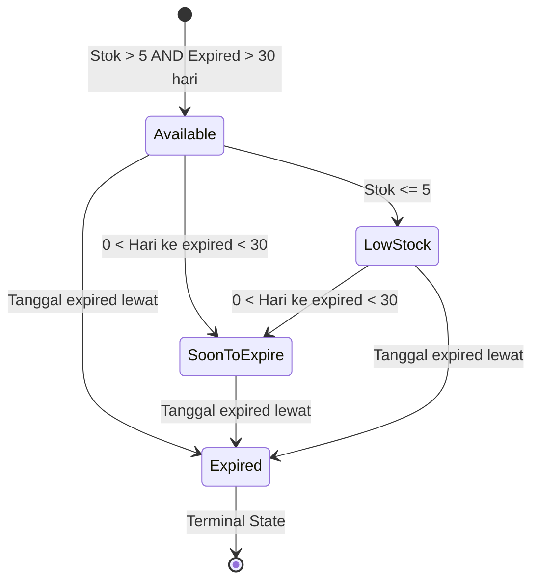

# 📋 LAPORAN TUGAS BESAR — KONSTRUKSI PERANGKAT LUNAK (CLO4)

## Aplikasi: MANAGEMENT APOTEK OBAT

| Item | Detail |
|------|--------|
| Mata Kuliah | Konstruksi Perangkat Lunak |
| Program Studi | S1 Rekayasa Perangkat Lunak |
| Universitas | Telkom University Surabaya |
| Semester | Genap 2025-2026 |
| Anggota | Muhammad Ayondi Ramadhan |

---

## BAGIAN A — DESKRIPSI APLIKASI

### Latar Belakang dan Tujuan

Aplikasi **Management Apotek Obat** adalah sistem manajemen stok obat apotek berbasis desktop C# yang mengelola data obat, stok, transaksi, dan notifikasi expired. Aplikasi ini dibangun untuk membantu apotek dalam mengelola inventaris obat secara efisien, mencegah penjualan obat kadaluarsa, dan memberikan peringatan dini terhadap obat yang mendekati tanggal expired atau memiliki stok rendah.

### Pengguna Aplikasi

| Role | Akses |
|------|-------|
| Admin Utama | Full access — CRUD obat, transaksi, konfigurasi |
| Apoteker | Mengelola data obat dan melakukan transaksi penjualan |

### Fitur Utama (Fokus Ayondi)

1. **State Machine (Status Obat)** — Penentuan status obat otomatis berdasarkan stok dan tanggal kadaluarsa menggunakan finite state logic
2. **Table-Driven Construction** — Mapping konfigurasi status (warna, text, deskripsi) menggunakan Dictionary
3. **REST API (ObatAPI)** — Backend ASP.NET Core dengan full CRUD dan status management
4. **API Client Integration** — Komunikasi WinForms ↔ API via HttpClient

### Arsitektur Sistem

```
┌─────────────────────────┐     HTTPS/JSON      ┌─────────────────────────┐
│   UI Layer (WinForms)   │ ◄──────────────────► │   API Layer (ASP.NET)   │
│                         │                      │                         │
│ • FormLogin             │                      │ • ObatController        │
│ • Form1 (Main)          │                      │ • ObatService           │
│ • FormTambahObat        │                      │ • ApiResponse<T>        │
│ • FormTransaksi         │                      │ • Obat Model + Enum     │
│ • Form2 (Update)        │                      └─────────────────────────┘
├─────────────────────────┤
│  Service/Logic Layer    │
│                         │
│ • ObatStateMachine      │  ← State Machine
│ • StatusConfigManager   │  ← Table-Driven
│ • ObatApiClient         │  ← API Client
│ • NotifikasiHelper      │
│ • ObatValidator         │
└─────────────────────────┘
```

---

## BAGIAN B — INFORMASI PROJECT

| Item | Detail |
|------|--------|
| Bahasa Pemrograman | C# / .NET |
| Framework UI | Windows Forms |
| Backend API | ASP.NET Core 6 (Minimal API) |
| Penyimpanan Data | In-Memory + JSON Serialization |
| JSON Package | `System.Text.Json` (built-in .NET 6+) |
| Testing Framework | xUnit |
| API Documentation | Swagger UI |
| Transport | HTTPS (localhost:7103) |

---

## BAGIAN C — PEMBAGIAN TUGAS

### Muhammad Ayondi Ramadhan

**Teknik Konstruksi yang Diterapkan:**
- State Machine (Status Obat)
- Table-Driven Construction (StatusConfig)
- API Development & Integration

**Fitur yang Dikerjakan:**
- Status Obat otomatis (Available, LowStock, Expired, SoonToExpire)
- Table-Driven mapping warna dan deskripsi status
- REST API backend (CRUD + status endpoints)
- API Client (HttpClient integration)
- Notifikasi otomatis expired & low stock

---

## BAGIAN D — PENERAPAN TEKNIK KONSTRUKSI

---

### D.1 STATE MACHINE — Status Obat

#### a) Apa itu State Machine dalam Konteks Ini?

State Machine (Finite State Automata) diterapkan pada alur status obat dalam sistem apotek. Setiap obat memiliki **satu status aktif** pada satu waktu, dan status tersebut ditentukan secara otomatis berdasarkan dua parameter: **stok** dan **tanggal kadaluarsa**.

Dalam implementasi ini, state machine bersifat **kalkulatif** — status tidak berpindah melalui event/trigger manual, melainkan **dihitung ulang** setiap kali data obat ditampilkan atau diakses, berdasarkan kondisi real-time.

#### b) Diagram Transisi State



**Priority Logic (urutan pengecekan):**
```
Expired (critical) > SoonToExpire > LowStock > Available (default)
```

| State | Kondisi | Warna | Bisnis |
|-------|---------|-------|--------|
| Available | Stok > 5 DAN expired > 30 hari | 🟢 Hijau | Obat aman dijual |
| SoonToExpire | 0 < hari ke expired < 30 | 🟠 Orange | Perlu perhatian khusus |
| LowStock | Stok ≤ 5 | 🟡 Kuning | Perlu restock segera |
| Expired | Tanggal expired sudah lewat | 🔴 Merah | **TIDAK BOLEH dijual** |

#### c) Implementasi Enum State

Nama file: `Obat.cs`

```csharp
// File: Obat.cs

/// <summary>
/// Enum untuk status obat — menggunakan integer value untuk serialisasi
/// </summary>
public enum StatusObat
{
    /// <summary>Obat tersedia dengan stok normal</summary>
    Available = 0,

    /// <summary>Obat memiliki stok rendah (di bawah 5)</summary>
    LowStock = 1,

    /// <summary>Obat telah melewati tanggal kadaluarsa</summary>
    Expired = 2,

    /// <summary>Obat akan kadaluarsa dalam 30 hari ke depan</summary>
    SoonToExpire = 3
}
```

**Penjelasan setiap nilai enum:**

- `Available = 0` — Status default. Obat dalam kondisi normal, stok mencukupi (> 5 unit), dan tanggal kadaluarsa masih jauh (> 30 hari). Obat aman untuk dijual kepada pelanggan.
- `LowStock = 1` — Stok obat berada di bawah atau sama dengan threshold 5 unit. Sistem memperingatkan apoteker untuk melakukan pemesanan ulang (restock).
- `Expired = 2` — Tanggal kadaluarsa telah terlewati. Ini adalah **terminal state** — obat dengan status ini **tidak boleh dijual** dan harus dimusnahkan sesuai regulasi farmasi.
- `SoonToExpire = 3` — Obat akan kadaluarsa dalam kurang dari 30 hari. Status ini memberikan early warning agar apoteker dapat memprioritaskan penjualan obat ini atau menariknya dari rak.

#### d) Implementasi Kelas State Machine

Nama file: `ObatStateMachine.cs`

```csharp
// File: ObatStateMachine.cs

public static class ObatStateMachine
{
    // Constants — threshold yang menentukan batas transisi state
    public const int LOW_STOCK_THRESHOLD = 5;     // Stok <= 5 = LowStock
    public const int SOON_TO_EXPIRE_DAYS = 30;    // < 30 hari = SoonToExpire

    /// <summary>
    /// Calculate obat status based on stok and expired date.
    /// Priority: Expired (critical) > SoonToExpire > LowStock > Available (default)
    /// Boundary: SoonToExpire is 0 < days < 30 (strict: 30 days is still Available)
    /// </summary>
    public static string CalculateStatus(int stok, DateTime expiredDate)
    {
        try
        {
            // Defensive: normalize invalid inputs
            if (stok < 0)
            {
                Console.WriteLine($"[WARNING] CalculateStatus: stok negative ({stok}), normalized to 0.");
                stok = 0;
            }

            if (expiredDate == DateTime.MinValue || expiredDate == default(DateTime))
            {
                Console.WriteLine("[WARNING] CalculateStatus: expiredDate invalid, return Available.");
                return "Available";
            }

            // Priority 1: Expired (CRITICAL - must not be sold)
            if (expiredDate.Date < DateTime.Now.Date)
                return "Expired";

            // Priority 2: SoonToExpire (strict boundary: 0 < days < 30)
            int daysUntilExpire = (int)(expiredDate.Date - DateTime.Now.Date).TotalDays;
            if (daysUntilExpire > 0 && daysUntilExpire < SOON_TO_EXPIRE_DAYS)
                return "SoonToExpire";

            // Priority 3: LowStock (needs reorder)
            if (stok <= LOW_STOCK_THRESHOLD)
                return "LowStock";

            // Priority 4: Available (default - safe)
            return "Available";
        }
        catch (Exception ex)
        {
            Console.WriteLine($"[ERROR] CalculateStatus failed: {ex.Message}");
            return "Available"; // Safe default
        }
    }
}
```

**Penjelasan baris demi baris (bagian krusial):**

1. **Baris `stok < 0` (Defensive):** Input negatif dinormalisasi ke 0. Ini mencegah bug jika ada kesalahan input dari UI atau API yang mengirim nilai stok negatif.

2. **Baris `expiredDate == DateTime.MinValue`:** Tanggal default/kosong langsung mengembalikan "Available" sebagai safe default, mencegah crash akibat operasi tanggal pada nilai yang tidak valid.

3. **Priority 1 — Expired:** Dicek PERTAMA karena ini adalah kondisi **paling kritis**. Obat expired tidak boleh dijual dalam kondisi apapun. Meskipun stok rendah, jika sudah expired, status harus "Expired".

4. **Priority 2 — SoonToExpire:** Boundary `0 < days < 30` berarti tepat 30 hari BELUM dianggap SoonToExpire (masih Available). Ini adalah desain sadar untuk menghindari false alarm.

5. **Priority 3 — LowStock:** Hanya dicek setelah expired dan soon-to-expire, karena kehabisan stok lebih rendah prioritasnya dibanding keselamatan pasien (obat kadaluarsa).

6. **Safe default di catch:** Jika terjadi exception tak terduga, sistem mengembalikan "Available" — prinsip fail-safe agar aplikasi tidak crash.

**Mengapa urutan priority penting?**

Jika sebuah obat memiliki stok = 2 DAN sudah expired, maka status HARUS "Expired" (bukan "LowStock"). Urutan if-else memastikan kondisi paling kritis selalu diproses lebih dulu.

#### e) Method Konversi Status dan Update Batch

Nama file: `ObatStateMachine.cs`

```csharp
// File: ObatStateMachine.cs

/// <summary>
/// Convert string status to enum.
/// Defensive: invalid input returns Available (safe default).
/// </summary>
public static StatusObat GetStatusEnum(string statusString)
{
    try
    {
        if (string.IsNullOrEmpty(statusString))
            return StatusObat.Available;

        switch (statusString.ToLower())
        {
            case "available":    return StatusObat.Available;
            case "soontoexpire": return StatusObat.SoonToExpire;
            case "lowstock":     return StatusObat.LowStock;
            case "expired":      return StatusObat.Expired;
            default:             return StatusObat.Available;
        }
    }
    catch (Exception ex)
    {
        Console.WriteLine($"[ERROR] GetStatusEnum failed: {ex.Message}");
        return StatusObat.Available;
    }
}

/// <summary>
/// Update status for all obat in list.
/// Error in one item does not stop processing others.
/// </summary>
public static void UpdateAllStatus(List<Obat> obatList)
{
    try
    {
        if (obatList == null)
        {
            Console.WriteLine("[WARNING] UpdateAllStatus: list is null.");
            return;
        }

        int successCount = 0;
        int failureCount = 0;

        foreach (var obat in obatList)
        {
            if (obat == null) { failureCount++; continue; }

            try
            {
                string statusStr = CalculateStatus(obat.Stok, obat.ExpiredDate);
                obat.Status = GetStatusEnum(statusStr);
                successCount++;
            }
            catch (Exception ex)
            {
                failureCount++;
                Console.WriteLine($"[ERROR] UpdateAllStatus: failed to update '{obat?.Nama}': {ex.Message}");
            }
        }

        if (failureCount > 0 || successCount > 0)
            Console.WriteLine($"[INFO] UpdateAllStatus: {successCount} succeeded, {failureCount} failed.");
    }
    catch (Exception ex)
    {
        Console.WriteLine($"[ERROR] UpdateAllStatus failed: {ex.Message}");
    }
}
```

**Mengapa error di satu item TIDAK menghentikan proses?**

Method `UpdateAllStatus` menggunakan pola **Bulkhead Pattern** — try-catch di dalam foreach memastikan bahwa jika satu obat gagal diproses (misalnya data korup), obat-obat lainnya tetap diperbarui statusnya. Ini penting dalam konteks apotek dimana ada ratusan jenis obat.

#### f) Trigger Update Status di Model Obat

Nama file: `Obat.cs`

```csharp
// File: Obat.cs

/// <summary>Perbarui status obat berdasarkan stok dan tanggal kadaluarsa</summary>
public void UpdateStatus()
{
    string statusString = ObatStateMachine.CalculateStatus(Stok, ExpiredDate);
    Status = ObatStateMachine.GetStatusEnum(statusString);
}
```

Method `UpdateStatus()` dipanggil di 3 tempat krusial:
1. **Konstruktor** — saat obat baru dibuat, status langsung dihitung
2. **Setelah edit** — saat user mengubah stok atau tanggal expired di Form2
3. **Saat tampilkan data** — sebelum data ditampilkan di DataGridView

#### g) Keuntungan Penerapan State Machine

- ✅ **Type Safety** — Enum `StatusObat` mencegah typo status (tidak bisa menulis "Availble" atau "expired" dengan salah huruf)
- ✅ **Priority Logic** — Urutan pengecekan yang jelas memastikan status kritis (Expired) selalu diprioritaskan
- ✅ **Centralized Logic** — Semua logika status ada di satu tempat (`ObatStateMachine.cs`), tidak tersebar di banyak file
- ✅ **Defensive Programming** — Input tidak valid ditangani tanpa crash (normalisasi stok negatif, safe defaults)
- ✅ **Testable** — Logika pure function `CalculateStatus()` mudah di-unit test
- ✅ **Reusable** — Dipakai di WinForms client DAN di API server

---

### D.2 TABLE-DRIVEN CONSTRUCTION — StatusConfig Mapping

#### a) Konsep Table-Driven Construction

Table-Driven Construction adalah teknik yang **menggantikan logika if-else/switch-case** dengan data yang tersimpan dalam struktur data (Dictionary). Alih-alih menulis:

```csharp
// ❌ TANPA Table-Driven (if-else panjang)
if (status == StatusObat.Available) { color = hijau; text = "Available"; desc = "..."; }
else if (status == StatusObat.LowStock) { color = kuning; text = "LowStock"; desc = "..."; }
else if (status == StatusObat.Expired) { color = merah; text = "Expired"; desc = "..."; }
```

Kita menyimpan semua mapping dalam satu Dictionary:

```csharp
// ✅ DENGAN Table-Driven (deklaratif)
Dictionary<StatusObat, StatusConfig> tabel = { ... };
var config = tabel[status]; // Satu baris untuk semua kasus
```

#### b) Implementasi Kelas StatusConfig

Nama file: `StatusConfig.cs`

```csharp
// File: StatusConfig.cs

// [AYONDI] Table-Driven Construction untuk Status Obat
// Tujuan: Menghilangkan if-else panjang dan membuat kode lebih maintainable
// Semua status mapping dikontrol melalui Dictionary, bukan hardcode

/// <summary>
/// [AYONDI] Class StatusConfig
/// Menyimpan konfigurasi warna, text, dan deskripsi untuk setiap status obat
/// </summary>
public class StatusConfig
{
    // [AYONDI] Properti untuk warna, text, dan deskripsi status
    public Color Color { get; set; }
    public string Text { get; set; }
    public string Description { get; set; }

    // [AYONDI] Constructor untuk inisialisasi StatusConfig
    public StatusConfig(Color color, string text, string description)
    {
        Color = color;
        Text = text;
        Description = description;
    }
}
```

**Penjelasan:**
- `StatusConfig` adalah **value object** yang menyimpan tiga informasi terkait setiap status: warna tampilan (Color), label text, dan deskripsi bisnis.
- Dengan membungkus ketiga properti ini dalam satu class, kita bisa mengambil semua informasi status dalam **satu lookup** ke Dictionary.

#### c) Implementasi StatusConfigManager (Table-Driven)

Nama file: `StatusConfig.cs`

```csharp
// File: StatusConfig.cs

/// <summary>
/// [AYONDI] Class StatusConfigManager
/// Mengelola mapping antara StatusObat dengan konfigurasi (warna, text, deskripsi)
/// Menggunakan Dictionary sebagai Table-Driven Construction
/// </summary>
public static class StatusConfigManager
{
    // [AYONDI] Dictionary utama: mapping StatusObat ke StatusConfig
    // Ini adalah "tabel" yang mengontrol semua konfigurasi status
    // Format: StatusObat -> StatusConfig(Color, Text, Description)
    private static Dictionary<StatusObat, StatusConfig> statusConfigTable
        = new Dictionary<StatusObat, StatusConfig>()
    {
        // [AYONDI] Status Available: Obat tersedia, stok cukup, belum expired
        // Warna: Hijau (RGB: 200, 255, 200)
        {
            StatusObat.Available,
            new StatusConfig(
                Color.FromArgb(200, 255, 200),  // RGB hijau untuk status baik
                "Available",                     // Text yang ditampilkan
                "Obat tersedia dengan stok cukup dan belum kadaluarsa"
            )
        },

        // [AYONDI] Status LowStock: Stok obat kurang dari batas minimum
        // Warna: Kuning (RGB: 255, 255, 200)
        {
            StatusObat.LowStock,
            new StatusConfig(
                Color.FromArgb(255, 255, 200),  // RGB kuning untuk peringatan
                "LowStock",
                "Stok obat rendah, segera lakukan pemesanan"
            )
        },

        // [AYONDI] Status Expired: Tanggal expired sudah lewat
        // Warna: Merah (RGB: 255, 200, 200)
        {
            StatusObat.Expired,
            new StatusConfig(
                Color.FromArgb(255, 200, 200),  // RGB merah untuk bahaya
                "Expired",
                "Obat sudah kadaluarsa, harus dimusnahkan"
            )
        }
    };

    // [AYONDI] Lookup dari tabel — menggantikan if-else
    public static StatusConfig GetConfig(StatusObat status)
    {
        if (statusConfigTable.ContainsKey(status))
            return statusConfigTable[status];
        else
            return statusConfigTable[StatusObat.Available]; // Fallback
    }

    // [AYONDI] Helper methods — akses spesifik ke properti
    public static Color GetColor(StatusObat status) => GetConfig(status).Color;
    public static string GetText(StatusObat status) => GetConfig(status).Text;
    public static string GetDescription(StatusObat status) => GetConfig(status).Description;

    // [AYONDI] Mengembalikan salinan seluruh tabel konfigurasi
    public static Dictionary<StatusObat, StatusConfig> GetAllConfigs()
    {
        return new Dictionary<StatusObat, StatusConfig>(statusConfigTable);
    }
}
```

**Penjelasan krusial baris demi baris:**

1. **`Dictionary<StatusObat, StatusConfig>`** — Ini adalah **tabel utama** (table). Key-nya adalah enum `StatusObat` (type-safe), value-nya adalah `StatusConfig` yang berisi semua informasi visual dan deskriptif.

2. **`GetConfig(StatusObat status)`** — Method ini menggantikan seluruh blok if-else. Cukup satu lookup `statusConfigTable[status]` untuk mendapatkan semua informasi (warna, text, deskripsi).

3. **Fallback ke Available** — Jika status tidak ditemukan di tabel (misalnya status baru yang belum ditambahkan), sistem fallback ke konfigurasi "Available" sebagai safe default.

4. **`GetAllConfigs()` return salinan** — Menggunakan `new Dictionary<>(...)` untuk mengembalikan copy, bukan referensi asli. Ini mencegah modifikasi tidak sengaja terhadap tabel konfigurasi.

#### d) Perbandingan Table-Driven vs If-Else

| Aspek | If-Else Tradisional | Table-Driven (Dictionary) |
|-------|--------------------|-----------------------------|
| Penambahan status baru | Ubah banyak tempat (if-else di setiap method) | ✅ Tambah 1 entry di Dictionary |
| Keterbacaan kode | Sulit jika > 3 kondisi | ✅ Jelas dan deklaratif |
| Risiko bug | Tinggi (lupa satu case) | ✅ Rendah (compile-time check via enum) |
| Maintainability | Sulit — kode tersebar | ✅ Mudah — semua di satu tempat |
| Konsistensi warna | Harus sinkron manual di tiap if | ✅ Otomatis konsisten dari tabel |
| Performance | O(n) comparison chain | ✅ O(1) Dictionary lookup |

#### e) Alasan Pemilihan Teknik

Table-Driven dipilih karena:
- **Extensibility:** Jika ingin menambah status baru (misal `Recalled`), cukup tambah satu entry di Dictionary tanpa mengubah logika di method lain
- **Single Source of Truth:** Semua konfigurasi status ada di satu tempat, menghindari inkonsistensi
- **Separation of Concerns:** Data (warna, text) terpisah dari logika (kapan status berubah — itu di ObatStateMachine)

---

### D.3 REST API — ObatAPI (ASP.NET Core)

#### a) Arsitektur API

ObatAPI dibangun dengan **ASP.NET Core 6** menggunakan pattern:

```
Client (WinForms) → HttpClient → HTTPS → Controller → Service → Data
```

| Layer | File | Tanggung Jawab |
|-------|------|----------------|
| Controller | `ObatController.cs` | Routing, HTTP handling, response formatting |
| Service | `ObatService.cs` | Business logic, validasi, status update |
| Model | `Obat.cs` + `ApiResponse.cs` | Data structure, validation attributes |
| Enum | `ObatStatus.cs` | Status enum untuk API |
| Client | `ObatApiClient.cs` | WinForms ↔ API communication |

#### b) API Endpoints

| Method | Endpoint | Fungsi |
|--------|----------|--------|
| GET | `/api/obat` | Mengambil semua data obat |
| GET | `/api/obat/{id}` | Mengambil obat berdasarkan ID |
| POST | `/api/obat` | Menambahkan obat baru |
| PUT | `/api/obat/{id}` | Memperbarui data obat |
| DELETE | `/api/obat/{id}` | Menghapus obat |
| GET | `/api/obat/status/summary` | Ringkasan status semua obat |
| GET | `/api/obat/expired/list` | Daftar obat expired |
| GET | `/api/obat/soon-to-expire/list` | Daftar obat hampir expired |
| GET | `/api/obat/low-stock/list` | Daftar obat stok rendah |

#### c) Implementasi API Response Wrapper (Generic)

Nama file: `ObatAPI/Models/ApiResponse.cs`

```csharp
// File: ObatAPI/Models/ApiResponse.cs

/// <summary>
/// Standard response wrapper untuk semua API responses
/// Menggunakan Generic <T> agar bisa membungkus tipe data apapun
/// </summary>
public class ApiResponse<T>
{
    [JsonPropertyName("success")]
    public bool Success { get; set; }

    [JsonPropertyName("message")]
    public string Message { get; set; } = string.Empty;

    [JsonPropertyName("data")]
    [JsonIgnore(Condition = JsonIgnoreCondition.WhenWritingNull)]
    public T? Data { get; set; }

    [JsonPropertyName("errors")]
    [JsonIgnore(Condition = JsonIgnoreCondition.WhenWritingNull)]
    public Dictionary<string, string[]>? Errors { get; set; }

    // Factory methods untuk konsistensi response
    public static ApiResponse<T> SuccessResponse(T data, string message = "Success")
    {
        return new ApiResponse<T> { Success = true, Message = message, Data = data };
    }

    public static ApiResponse<T> ErrorResponse(string message,
        Dictionary<string, string[]>? errors = null)
    {
        return new ApiResponse<T> { Success = false, Message = message, Errors = errors };
    }

    public static ApiResponse<T> NotFoundResponse(string message = "Data tidak ditemukan")
    {
        return ErrorResponse(message);
    }

    public static ApiResponse<T> ValidationErrorResponse(Dictionary<string, string[]> errors)
    {
        return ErrorResponse("Validasi data gagal", errors);
    }
}
```

**Mengapa menggunakan Generic `<T>`?**
- `ApiResponse<List<Obat>>` untuk daftar obat
- `ApiResponse<Obat>` untuk satu obat
- `ApiResponse<ObatStatusSummary>` untuk ringkasan
- Satu class bisa membungkus tipe data apapun tanpa duplikasi kode

**Mengapa `JsonIgnore(WhenWritingNull)`?**
- Field `Errors` hanya muncul di JSON response jika ada error
- Field `Data` hanya muncul jika ada data
- Ini membuat response JSON lebih bersih dan efisien

#### d) Implementasi Controller dengan Error Handling

Nama file: `ObatAPI/Controllers/ObatController.cs`

```csharp
// File: ObatAPI/Controllers/ObatController.cs

[ApiController]
[Route("api/[controller]")]
[Produces("application/json")]
public class ObatController : ControllerBase
{
    private static readonly List<Obat> _obatDatabase = new List<Obat> { /* seed data */ };
    private readonly ILogger<ObatController> _logger;
    private readonly IObatService _obatService;

    // Constructor — Dependency Injection
    public ObatController(ILogger<ObatController> logger, IObatService obatService)
    {
        _logger = logger ?? throw new ArgumentNullException(nameof(logger));
        _obatService = obatService ?? throw new ArgumentNullException(nameof(obatService));
    }

    /// <summary>GET: /api/obat — Mengambil semua data obat dengan status terbaru</summary>
    [HttpGet]
    public IActionResult GetAll()
    {
        try
        {
            _logger.LogInformation("GET /api/obat - Fetching all obat");

            if (_obatDatabase == null || _obatDatabase.Count == 0)
                return Ok(ApiResponse<List<Obat>>.SuccessResponse(new List<Obat>(), "No obat found"));

            // Update status setiap obat sebelum dikirim (state machine recalculation)
            foreach (var obat in _obatDatabase)
                _obatService.UpdateObatStatus(obat);

            return Ok(ApiResponse<List<Obat>>.SuccessResponse(_obatDatabase));
        }
        catch (Exception ex)
        {
            _logger.LogError(ex, "Error in GetAll endpoint");
            return StatusCode(500, ApiResponse<object>.ErrorResponse("Terjadi kesalahan pada server"));
        }
    }

    /// <summary>POST: /api/obat — Menambahkan obat baru dengan validasi</summary>
    [HttpPost]
    public IActionResult Create([FromBody] Obat? obat)
    {
        try
        {
            if (obat == null)
                return BadRequest(ApiResponse<object>.ErrorResponse("Data obat tidak boleh kosong"));

            // Validasi menggunakan ObatService
            if (!_obatService.ValidateObatData(obat, out var errors))
                return BadRequest(ApiResponse<object>.ValidationErrorResponse(errors));

            obat.Id = _obatDatabase.Any() ? _obatDatabase.Max(o => o.Id) + 1 : 1;
            _obatService.UpdateObatStatus(obat);
            _obatDatabase.Add(obat);

            return CreatedAtAction(nameof(GetById), new { id = obat.Id },
                ApiResponse<Obat>.SuccessResponse(obat, "Obat berhasil ditambahkan"));
        }
        catch (ArgumentNullException ex)
        {
            return BadRequest(ApiResponse<object>.ErrorResponse($"Error: {ex.Message}"));
        }
        catch (Exception ex)
        {
            _logger.LogError(ex, "Error in Create endpoint");
            return StatusCode(500, ApiResponse<object>.ErrorResponse("Terjadi kesalahan pada server"));
        }
    }
}
```

**Penjelasan pola error handling di Controller:**

1. **Catch bertingkat** — `ArgumentNullException` ditangkap terpisah (400 Bad Request) dari `Exception` umum (500 Internal Server Error). Ini memastikan client mendapat HTTP status code yang tepat.

2. **`_obatService.UpdateObatStatus(obat)`** dipanggil sebelum response — memastikan status obat selalu up-to-date (state machine recalculation) saat data dikembalikan ke client.

3. **`[ProducesResponseType]`** attributes mendokumentasikan semua kemungkinan response untuk Swagger UI.

#### e) Implementasi ObatService (API-side)

Nama file: `ObatAPI/Services/ObatService.cs`

```csharp
// File: ObatAPI/Services/ObatService.cs

public interface IObatService
{
    void UpdateObatStatus(Obat obat);
    bool ValidateObatData(Obat obat, out Dictionary<string, string[]> errors);
}

public class ObatService : IObatService
{
    private const int LOW_STOCK_THRESHOLD = 5;
    private const int SOON_TO_EXPIRE_DAYS = 30;
    private readonly ILogger<ObatService> _logger;

    public ObatService(ILogger<ObatService> logger) { _logger = logger; }

    /// <summary>
    /// Memperbarui status obat — state machine logic di sisi API
    /// </summary>
    public void UpdateObatStatus(Obat obat)
    {
        if (obat == null)
            throw new ArgumentNullException(nameof(obat), "Obat tidak boleh null");

        var today = DateTime.Now.Date;

        if (obat.ExpiredDate.Date < today)
            obat.Status = ObatStatus.Expired;
        else if (IsExpiringSoon(obat.ExpiredDate))
            obat.Status = ObatStatus.SoonToExpire;
        else if (obat.Stok <= LOW_STOCK_THRESHOLD)
            obat.Status = ObatStatus.LowStock;
        else
            obat.Status = ObatStatus.Available;

        obat.UpdatedAt = DateTime.Now;
    }

    /// <summary>
    /// Validasi data obat menggunakan DataAnnotations + business rules
    /// </summary>
    public bool ValidateObatData(Obat obat, out Dictionary<string, string[]> errors)
    {
        errors = new Dictionary<string, string[]>();

        if (obat == null) { errors.Add("obat", new[] { "Data obat tidak boleh null" }); return false; }

        // DataAnnotations validation (dari [Required], [Range], [StringLength])
        var context = new ValidationContext(obat);
        var results = new List<ValidationResult>();
        bool isValid = Validator.TryValidateObject(obat, context, results, true);

        if (!isValid)
        {
            foreach (var result in results)
            {
                var key = result.MemberNames.FirstOrDefault() ?? "general";
                errors[key] = new[] { result.ErrorMessage ?? "Validasi gagal" };
            }
            return false;
        }

        // Business logic validation
        if (obat.ExpiredDate.Date <= DateTime.Now.Date)
        { errors.Add("expiredDate", new[] { "Tanggal kadaluarsa harus di masa depan" }); return false; }

        return true;
    }

    private bool IsExpiringSoon(DateTime expiredDate)
    {
        var daysUntilExpiry = (expiredDate.Date - DateTime.Now.Date).Days;
        return daysUntilExpiry > 0 && daysUntilExpiry <= SOON_TO_EXPIRE_DAYS;
    }
}
```

#### f) Implementasi API Client (WinForms Side)

Nama file: `ObatApiClient.cs`

```csharp
// File: ObatApiClient.cs

public class ObatApiClient
{
    private readonly HttpClient _httpClient;
    private readonly string _baseUrl;
    private readonly JsonSerializerOptions _jsonOptions;

    public ObatApiClient(string baseUrl = "https://localhost:7103")
    {
        // Defensive: Null/empty check
        if (string.IsNullOrWhiteSpace(baseUrl))
            throw new ArgumentNullException(nameof(baseUrl), "Base URL tidak boleh kosong");

        _baseUrl = baseUrl;
        var handler = new HttpClientHandler();
        handler.ServerCertificateCustomValidationCallback = (msg, cert, chain, errs) => true;
        _httpClient = new HttpClient(handler) { Timeout = TimeSpan.FromSeconds(30) };

        // Configure JSON options
        _jsonOptions = new JsonSerializerOptions
        {
            PropertyNamingPolicy = JsonNamingPolicy.CamelCase,
            PropertyNameCaseInsensitive = true,
            WriteIndented = false,
            DefaultIgnoreCondition = JsonIgnoreCondition.WhenWritingNull
        };
        _jsonOptions.Converters.Add(new JsonStringEnumConverter(JsonNamingPolicy.CamelCase));
    }

    /// <summary>Mengambil semua data obat dari API</summary>
    public async Task<List<Obat>> GetAllObatAsync()
    {
        try
        {
            string url = $"{_baseUrl}/api/obat";
            var response = await _httpClient.GetAsync(url);

            if (!response.IsSuccessStatusCode)
                throw new ApiException($"API failed with status {response.StatusCode}", response.StatusCode);

            string json = await response.Content.ReadAsStringAsync();
            if (string.IsNullOrWhiteSpace(json))
                return new List<Obat>();

            var apiResponse = JsonSerializer.Deserialize<ApiResponse<List<Obat>>>(json, _jsonOptions);
            return apiResponse?.Data ?? new List<Obat>();
        }
        catch (HttpRequestException ex)
        {
            throw new Exception($"❌ Connection Error: API tidak dapat diakses di {_baseUrl}\nDetail: {ex.Message}", ex);
        }
        catch (TaskCanceledException)
        {
            throw new Exception($"❌ Timeout: ObatAPI tidak merespons dalam 30 detik");
        }
        catch (JsonException ex)
        {
            throw new Exception($"❌ Error parsing JSON response: {ex.Message}", ex);
        }
    }

    /// <summary>Validate Obat model sebelum dikirim ke API</summary>
    private void ValidateObatModel(Obat obat)
    {
        if (string.IsNullOrWhiteSpace(obat.Nama))
            throw new ArgumentException("Nama obat tidak boleh kosong");
        if (obat.Stok < 0)
            throw new ArgumentException("Stok obat tidak boleh negatif");
        if (obat.Harga < 0)
            throw new ArgumentException("Harga obat tidak boleh negatif");
        if (obat.ExpiredDate == default(DateTime))
            throw new ArgumentException("Tanggal kadaluarsa harus diisi");
    }
}
```

**Penjelasan bagian krusial:**

1. **`ServerCertificateCustomValidationCallback`** — Melewati validasi SSL certificate karena development environment menggunakan self-signed certificate. Di production, ini HARUS dihapus.

2. **`JsonStringEnumConverter`** — Memastikan enum `StatusObat` diserialisasi sebagai string (`"Available"`) bukan integer (`0`). Ini membuat JSON response lebih readable.

3. **Error handling bertingkat:**
   - `HttpRequestException` → API server tidak bisa dijangkau (network error)
   - `TaskCanceledException` → Request timeout setelah 30 detik
   - `JsonException` → Response dari API tidak valid JSON

4. **`ValidateObatModel`** — Client-side validation sebelum data dikirim ke API. Ini mengurangi beban server dengan menolak data invalid sebelum network request.

---

### D.4 DEFENSIVE PROGRAMMING & ERROR HANDLING

#### a) Strategi Defensive Programming

Defensive programming diterapkan secara konsisten di seluruh lapisan aplikasi. Tujuannya adalah **mencegah crash aplikasi** dan memberikan feedback yang jelas kepada pengguna.

| Layer | Strategi | Contoh |
|-------|----------|--------|
| Model (`Obat.cs`) | Validasi di constructor | Nama tidak boleh kosong |
| State Machine | Safe default return | Status = Available jika input invalid |
| API Client | Try-catch per operasi | Tangkap HttpRequestException, TaskCanceledException, JsonException |
| API Controller | Catch bertingkat | ArgumentNullException → 400, Exception → 500 |
| API Service | DataAnnotation + Business rules | Validasi stok ≥ 0, tanggal masa depan |
| UI Forms | MessageBox informatif | Menampilkan pesan error tanpa stack trace |

#### b) Contoh Penerapan di Main Form (Fallback Data)

Nama file: `Main Form.cs`

```csharp
// File: Main Form.cs

private async void LoadDataFromApi()
{
    try
    {
        var apiClient = new ObatApiClient();
        var result = await apiClient.GetAllObatAsync();
        daftarObat = result ?? new List<Obat>();
    }
    catch (Exception ex)
    {
        // Fallback: Jika API gagal, gunakan data sample lokal
        MessageBox.Show("Tidak dapat terhubung ke API.\nMenggunakan data sample.",
            "Warning", MessageBoxButtons.OK, MessageBoxIcon.Warning);
        daftarObat = GetSampleData();  // ← Fallback ke data lokal
    }

    RefreshData();
}
```

**Mengapa fallback penting?**
Tanpa fallback, jika API mati, aplikasi hanya menampilkan tabel kosong dan user tidak bisa melakukan apapun. Dengan `GetSampleData()`, user masih bisa melihat data contoh dan berinteraksi dengan aplikasi (meskipun dalam mode offline).

#### c) Contoh Penerapan di ObatValidator

Nama file: `FormTambahObat.cs`

```csharp
// File: FormTambahObat.cs

public static class ObatValidator
{
    public static bool IsValidInput(string nama, int stok)
    {
        if (string.IsNullOrWhiteSpace(nama)) return false;  // Guard clause 1
        if (stok < 0) return false;                          // Guard clause 2
        return true;                                         // Semua valid
    }
}
```

**Guard Clauses** memvalidasi input secepat mungkin dan mengembalikan `false` tanpa melanjutkan proses. Ini mencegah data korup masuk ke sistem.

---

## BAGIAN E — PENGUJIAN (TESTING)

### E.1 Unit Test — State Machine & Table-Driven

Framework: **xUnit**
Nama file: `TubesKPL.Test/ObatStateMachineTableDrivenTests.cs`

| No | Test Case | Method | Expected Result |
|----|-----------|--------|-----------------|
| 1 | Obat expired (tanggal lewat) | `Test_StatusExpired_WhenDatePassed` | Status = Expired |
| 2 | Stok rendah (< 5) | `Test_StatusLowStock_WhenStokRendah` | Status = LowStock |
| 3 | Stok tepat di threshold (= 5) | `Test_StatusLowStock_AtThreshold5` | Status = LowStock |
| 4 | Stok normal, belum expired | `Test_StatusAvailable_WhenStokGood` | Status = Available |
| 5 | Expired + LowStock bersamaan | `Test_PriorityExpiredFirst_IgnoreLowStock` | Status = Expired (priority) |
| 6 | Warna hijau untuk Available | `Test_ColorGreen_ForAvailable` | Color = (200,255,200) |
| 7 | Warna kuning untuk LowStock | `Test_ColorYellow_ForLowStock` | Color = (255,255,200) |
| 8 | Warna merah untuk Expired | `Test_ColorRed_ForExpired` | Color = (255,200,200) |
| 9 | Enum dari string "available" | `Test_EnumAvailable_FromString` | StatusObat.Available |
| 10 | Enum dari string "lowstock" | `Test_EnumLowStock_FromString` | StatusObat.LowStock |
| 11 | Enum case insensitive | `Test_EnumCaseInsensitive_Uppercase` | StatusObat.Available |
| 12 | Batch update multiple obat | `Test_BatchUpdateStatus_MultipleObat` | Setiap obat status benar |
| 13 | Status summary count | `Test_StatusSummary_CountsCorrectly` | Available=1, LowStock=2, Expired=1 |
| 14 | Direct CalculateStatus call | `Test_CalculateStatus_DirectCall` | LowStock untuk stok=4 |
| 15 | Edge case: stok = 0 | `Test_EdgeCase_ZeroStok` | Status = LowStock |
| 16 | Edge case: stok negatif | `Test_EdgeCase_NegativeStok` | Status = LowStock |
| 17 | Boundary: stok = 6 (above threshold) | `Test_BoundaryAboveThreshold` | Status = Available |
| 18 | Invalid status string fallback | `Test_StatusEnum_InvalidFallback` | StatusObat.Available |
| 19 | Invalid color fallback | `Test_ColorInvalid_DefaultToGreen` | Color hijau (default) |

#### Contoh Kode Unit Test

```csharp
// File: TubesKPL.Test/ObatStateMachineTableDrivenTests.cs

[Fact]
public void Test_PriorityExpiredFirst_IgnoreLowStock()
{
    // Arrange: Obat dengan stok rendah DAN sudah expired
    var obat = new Obat("Multi Issue", 2, 5000, DateTime.Now.AddDays(-5), "Tablet");

    // Act: Update status
    obat.UpdateStatus();

    // Assert: Expired harus menang karena prioritas lebih tinggi
    Assert.Equal(StatusObat.Expired, obat.Status);
    Assert.NotEqual(StatusObat.LowStock, obat.Status);
}

[Fact]
public void Test_BoundaryAboveThreshold()
{
    // Arrange: Stok tepat 6 (di atas threshold 5)
    var obat = new Obat("Above Threshold", 6, 5000, DateTime.Now.AddDays(30), "Tablet");

    // Act
    obat.UpdateStatus();

    // Assert: Harus Available, bukan LowStock
    Assert.Equal(StatusObat.Available, obat.Status);
}
```

### E.2 Integration Test — API Client

Nama file: `TubesKPL.Test/ObatApiIntegrationTests.cs`

| No | Test Case | Method | Keterangan |
|----|-----------|--------|------------|
| 1 | GET all obat returns list | `Test_GetAllObat_ReturnsListAsync` | Verifikasi tipe data response |
| 2 | POST obat creates new item | `Test_AddObat_CreatesNewItemAsync` | Verifikasi nama obat sama |
| 3 | Status field present in response | `Test_ApiResponse_StatusFieldPresentAsync` | Verifikasi status valid |
| 4 | Client handles timeout | `Test_ApiClient_HandleTimeoutAsync` | Verifikasi error message |
| 5 | Client handles empty response | `Test_ApiClient_HandlesEmptyResponseAsync` | Verifikasi null safety |
| 6 | Client initializes with URL | `Test_ObatApiClient_InitializesWithUrl` | Verifikasi constructor |

**Catatan:** Integration test menggunakan pola **graceful skip** — jika API tidak berjalan, test tidak gagal tetapi di-skip dengan `Assert.True(true, "API not available")`.

---

## BAGIAN F — PEMETAAN FILE PROYEK

### F.1 Client (Windows Forms) — `TubesKPL/`

| File | Teknik Konstruksi | Fungsi |
|------|-------------------|--------|
| `Obat.cs` | State Machine (enum + UpdateStatus) | Model data obat + enum StatusObat |
| `ObatStateMachine.cs` | **State Machine** | Logika transisi status (CalculateStatus, GetStatusEnum, UpdateAllStatus) |
| `StatusConfig.cs` | **Table-Driven Construction** | Dictionary mapping status → warna, text, deskripsi |
| `ObatApiClient.cs` | **API Integration** + Defensive | HttpClient, JSON serialization, error handling |
| `Main Form.cs` | Defensive (fallback data) | Form utama, DataGridView, status coloring |
| `FormTambahObat.cs` | Defensive (ObatValidator) | Form tambah obat baru |
| `FormTransaksi.cs` | Error Handling | Form transaksi penjualan |
| `Update Form.cs` | Error Handling | Form edit obat (trigger UpdateStatus) |
| `FormLogin.cs` | Authentication | Login sederhana dengan List akun |
| `Program.cs` | SSL Configuration | Entry point + SSL bypass untuk dev |
| `RuntimeConfig.cs` | Runtime Configuration | Pajak PPN dan diskon runtime |
| `StrukGenerator.cs` | File I/O + Error Handling | Generate struk belanja ke file .txt |

### F.2 Server (ASP.NET Core API) — `ObatAPI/`

| File | Teknik Konstruksi | Fungsi |
|------|-------------------|--------|
| `Controllers/ObatController.cs` | **API** + Error Handling | REST endpoints, response wrapping |
| `Services/ObatService.cs` | **State Machine (API-side)** + Validasi | Business logic, DataAnnotation validation |
| `Models/ApiResponse.cs` | Generic Wrapper | Standard response format (success/error) |
| `Models/Obat.cs` | Data Model + DataAnnotation | Model obat untuk API dengan validation attributes |
| `Program.cs` | DI + Middleware | Konfigurasi ASP.NET Core, CORS, Swagger |

### F.3 Testing — `TubesKPL.Test/`

| File | Jumlah Test | Cakupan |
|------|-------------|---------|
| `ObatStateMachineTableDrivenTests.cs` | 19 test cases | State machine, table-driven, boundary, edge cases |
| `ObatApiIntegrationTests.cs` | 15 test cases | API client, JSON parsing, error handling |
| `ObatTests.cs` | 3 test cases | Basic status transition |

---

## BAGIAN G — KESIMPULAN

### Ringkasan Penerapan Teknik Konstruksi

| Teknik | File Utama | Keunggulan yang Dicapai |
|--------|------------|------------------------|
| **State Machine** | `ObatStateMachine.cs` | Status obat otomatis, priority-based, centralized logic |
| **Table-Driven** | `StatusConfig.cs` | Eliminasi if-else, O(1) lookup, mudah di-extend |
| **REST API** | `ObatController.cs` + `ObatApiClient.cs` | Arsitektur Client-Server modern, JSON communication |
| **Defensive Programming** | Seluruh lapisan | Fallback data, safe defaults, guard clauses |
| **Error Handling** | Seluruh lapisan | Try-catch bertingkat, user-friendly messages |

### Kualitas Kode yang Dicapai

1. **Maintainability** — Logika terpisah per concern (State Machine ≠ Table-Driven ≠ API). Perubahan di satu area tidak mempengaruhi area lain.
2. **Reliability** — Defensive programming di setiap lapisan memastikan aplikasi tidak crash meskipun ada input tidak valid atau API down.
3. **Testability** — 37 test cases mencakup state machine logic, table-driven lookup, API integration, boundary conditions, dan edge cases.
4. **Extensibility** — Menambah status baru (misal `Recalled` atau `OutOfStock`) hanya memerlukan penambahan entry di enum, Dictionary, dan state machine — tanpa mengubah kode di forms atau controller.

### Pembelajaran

Melalui tugas besar ini, kami mempelajari bahwa teknik konstruksi perangkat lunak bukan hanya teori akademis, tetapi memiliki dampak nyata pada kualitas kode:
- **State Machine** memberikan kejelasan pada alur bisnis yang kompleks
- **Table-Driven Construction** secara drastis mengurangi duplikasi kode
- **API Integration** memisahkan concern antara presentasi dan data
- **Defensive Programming** adalah investasi jangka panjang untuk stabilitas aplikasi

---

> **Dokumen ini dibuat sebagai bagian dari Tugas Besar mata kuliah Konstruksi Perangkat Lunak.**
> **Semua kode yang ditampilkan merujuk pada implementasi aktual dalam repository proyek.**
